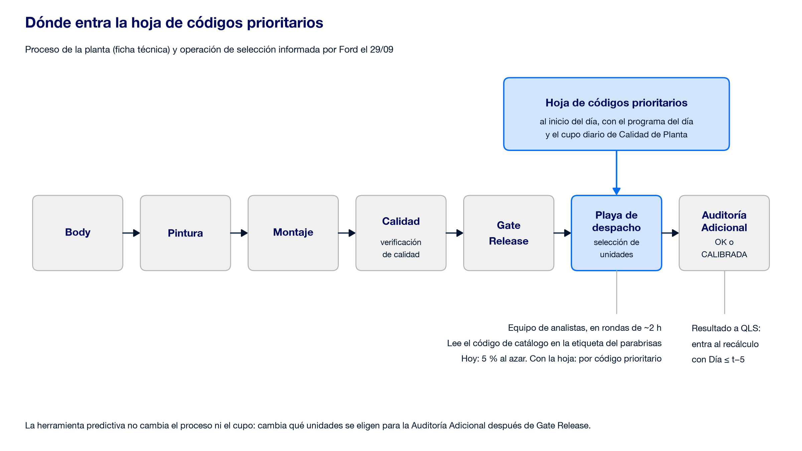
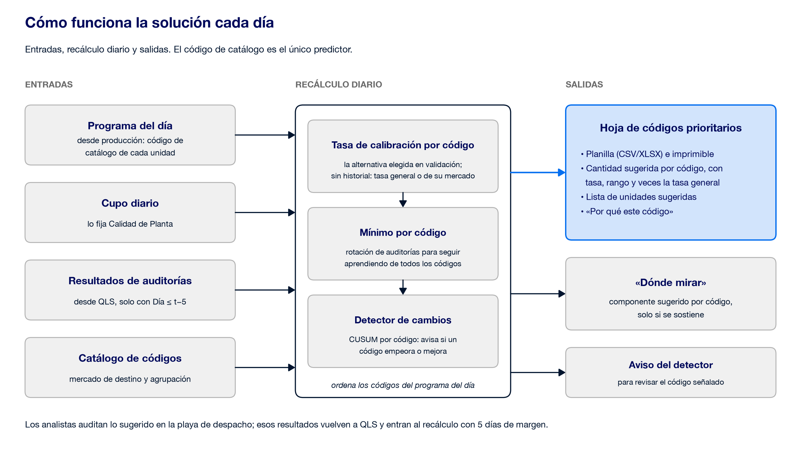

# 2.2.1 Información complementaria

Borrador para la sección 2.2.1 del Informe (E2). El template pide aquí «todos los entregables que se puedan adjuntar, como diagramas de flujo e imágenes» ([alcance de entrega][alc]). Contiene el resumen de la hoja de códigos prioritarios (E3), los dos diagramas y la lista de lo que va en el .zip (E4).

## La hoja de códigos prioritarios (E3)

La ficha valora «un dashboard o reporte accionable» que presente las predicciones, identifique las unidades priorizadas y muestre las variables de mayor impacto ([ficha técnica][ficha]). Nuestra respuesta para el 2/10 es un **reporte estático diario**: la hoja, en planilla e imprimible ([salida para Calidad][sal], punto 7; [uso de la agrupación][agr], punto 2). Para la implementación proponemos además una **plataforma web** que muestra la hoja, el detalle por código, las alertas, la evidencia del modelo y el seguimiento de los días de control; en la presentación se muestra con un prototipo de pantallas ([trabajo futuro](05-trabajo-futuro.md#7-plataforma-web); [#33](https://github.com/FordwardAI/ford-predictive-quality/issues/33)).

### Cómo se usa

1. **Al inicio del día**, un script recibe el programa de producción (qué códigos y cuántas unidades) y el cupo que fija Calidad de Planta ([plan][plan-inc], incompatibilidad 7).
2. Recalcula la tasa reciente de cada código con los resultados de auditoría ya conocidos (Día ≤ t−5) y arma la hoja.
3. El **equipo de analistas** la lleva en sus rondas por la playa de despacho. En cada ronda toma unidades de los códigos con cantidad pendiente, leyendo el código en el parabrisas ([operación][ope], decisiones 1 y 2).
4. Si un código no llega a la playa, la cantidad pendiente pasa a los códigos siguientes del ranking que sí llegaron. Solo se completa al azar si se agota el ranking ([CONTEXT.md][ctx], «Hoja de códigos prioritarios»).

### Qué muestra

| Bloque | Contenido | Fuente de la decisión |
| --- | --- | --- |
| Caja de evaluación, arriba | La frase permitida con el calificador «entre auditados con actividad QLS, [tramo], base ficticia, n = …» y los límites fijos | [Salida para Calidad][sal], punto 2; [base QLS][qls], punto 2 |
| Tabla de códigos | Código (primero, porque es lo que se lee en el parabrisas), cantidad sugerida, tasa reciente del código con rango del 95 % y n, veces la tasa general, acumulado, y columnas legibles: mercado de destino, versión, motor y tracción (motor y versión marcados «dominante») | [Uso de la agrupación][agr], punto 2; [operación][ope], decisión 1 |
| Filas de exploración, aparte | Los códigos que reciben auditoría por el **mínimo por código** | [Base QLS][qls], punto 5; [plan][plan-piezas], P8 |
| «Por qué este código» | Mercado de destino y la comparación entre agrupaciones | [Plan][plan-inc], incompatibilidad 8 |
| Lista de unidades sugeridas | Si el programa trae identificadores de unidad. En la demo son ficticios, nunca VIN | [Plan][plan-piezas], P8 |
| «Dónde mirar» y códigos que casi no se calibran | Solo si se sostienen en la prueba final, rotulados «asociación, no causa» | [Salida para Calidad][sal], punto 6; [alternativas][alt], punto 11 |

Nunca muestra «probabilidad de la unidad» ni un score por vehículo: dentro de un código las unidades son equivalentes ([salida para Calidad][sal], puntos 1 y 2).

**Formatos:** planilla (CSV/XLSX) e imprimible de una página. El informe la presenta como «formato adaptable a la operación», porque no se sabe cómo la usaría Ford ([uso de la agrupación][agr], punto 2).

**Día que se muestra:** el último día de la prueba ≤260, generado después de la corrida única ([plan][plan-piezas], P8). Captura: [pendiente: P7 — hoja del último día ≤260].

**Hoja de desarrollo (Día 190, validación).** Con un programa simulado a partir de las unidades de ese día (identificadores ficticios): 297 unidades de 28 códigos, cupo de 14 y 14 unidades sugeridas, toda la cantidad sugerida en un solo código, más 2 filas de mínimo por código (P = 40), sin cupo sin cubrir y sin ningún VIN en las salidas ([`p8.json`][p8]). Entre auditados con actividad QLS, validación 155–194, base ficticia. Que un solo código concentre el cupo es lo esperable cuando su tasa se destaca: por eso existen las filas de mínimo por código.

**Criterio de aceptación:** una persona de Calidad podría decidir qué auditar mirándola, sin explicación técnica ([alcance de entrega][alc-ent], E3).

## Diagrama del proceso

*Figura: verificación de calidad (QLS) → Gate Release → playa de despacho (0 a 5 días; aquí los analistas eligen con la hoja) → Auditoría Adicional → OK o CALIBRADA. El resultado vuelve, con 5 días de margen, a la tasa reciente del código.*

## Diagrama de la solución

*Figura: entradas (CSV de QLS con resultados de auditoría, catálogo, programa del día, cupo) → recálculo diario de la tasa reciente del código con Día ≤ t−5 → hoja de códigos prioritarios (planilla e imprimible) → auditorías del día → resultados que alimentan el recálculo siguiente, incluido el mínimo por código y el detector de cambios.*

## Qué va en el .zip (E4)

Todo lo que no entra en el informe y permite reproducir sus números. **Sin datos crudos, sin VIN** ([plan][plan-piezas], P13).

| Archivo o carpeta | Qué es |
| --- | --- |
| `solucion/` | Código de la prueba de concepto, con su README de reproducción |
| `solucion/pruebas/` | Pruebas con datos sintéticos, que no necesitan el CSV |
| `requirements.txt` y `.python-version` | Entorno fijado: Python 3.13 y versiones exactas de cada paquete |
| `solucion/resultados/*.json` | Agregados por alternativa y por día, sin VIN ni tasas por código |
| `solucion/preregistro.json` | Preregistro de la prueba final ([pendiente: P7]) |
| `research/` | Auditoría del CSV, particiones y agrupación del catálogo, con sus pruebas |
| Hoja completa del día mostrado | Planilla (CSV/XLSX) e imprimible (HTML) del último día ≤260 ([pendiente: P7]) |
| Figuras | Todas las de [`figuras/`](figuras/) (PNG y SVG), regeneradas con el comando único |
| README de reproducción | Cómo correr todo desde cero con las rutas del CSV y del catálogo, que se verifican por SHA-256 |

La hoja tiene tasas reales por código de la base ficticia: por eso no se versiona en el repo y va solo en el .zip ([`solucion/README.md`][sol]).

[ficha]: ../fuentes/documentation.md
[ctx]: ../../CONTEXT.md
[sol]: ../../solucion/README.md
[p8]: ../../solucion/resultados/p8.json
[alc]: ../alcance-entrega.md#qué-exigen-los-templates
[alc-ent]: ../alcance-entrega.md#entregables
[plan-inc]: ../plan-de-accion.md#incompatibilidades-y-cómo-se-resuelven
[plan-piezas]: ../plan-de-accion.md#piezas-de-trabajo
[sal]: https://github.com/FordwardAI/ford-predictive-quality/issues/11#issuecomment-5817130432
[alt]: https://github.com/FordwardAI/ford-predictive-quality/issues/10#issuecomment-5820794998
[ope]: https://github.com/FordwardAI/ford-predictive-quality/issues/23#issuecomment-5896188950
[agr]: https://github.com/FordwardAI/ford-predictive-quality/issues/27#issuecomment-5896362581
[qls]: https://github.com/FordwardAI/ford-predictive-quality/issues/29#issuecomment-5896631478
