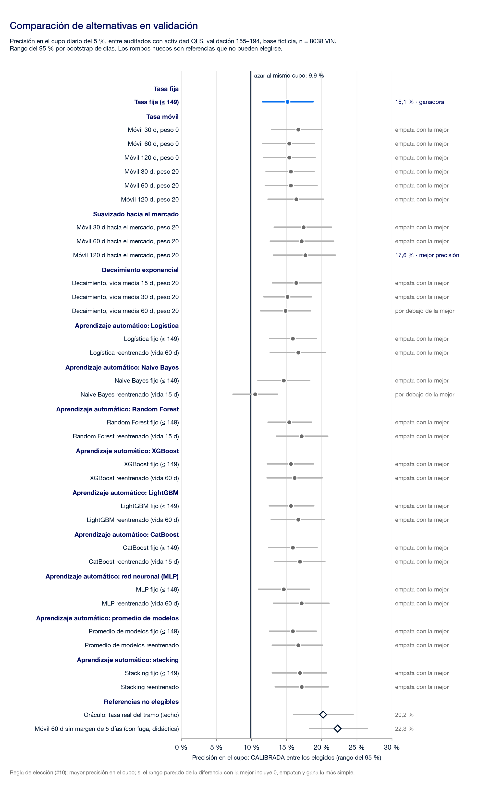

# 2.2 Especificaciones técnicas

Borrador para la sección 2.2 del Informe (E2). Cubre las cuatro partes que la ficha declara obligatorias ([ficha técnica][ficha], «Base de Datos»; [alcance de entrega][alc-ficha]):

| Parte de la ficha | Apartado |
| --- | --- |
| Enfoque metodológico y lógica conceptual | [A](#a-enfoque-metodológico-y-lógica-conceptual) |
| Elección del modelo frente a otras alternativas | [B](#b-elección-del-modelo-frente-a-otras-alternativas) |
| Preparación de los datos | [C](#c-preparación-de-los-datos) |
| Esquema de validación que demuestre efectividad | [D](#d-esquema-de-validación-sin-fuga) |

Las cifras de validación salen de [`solucion/resultados/p3.json`][p3], [`eleccion.json`][elec], [`precision.json`][prec] y [`preparacion.json`][prep]; las de la prueba final, de [`prueba-final.json`][final]. Todos se generan con el comando único de [`solucion/`][sol]. Fuente: CSV con SHA-256 `a24860d8…c5a82b` y catálogo con SHA-256 `89e5a9d9…3e047` ([datos locales][dl]). Unidad de análisis: VIN.

---

## A. Enfoque metodológico y lógica conceptual

### La lógica en cuatro pasos

1. **La decisión es qué unidades auditar dentro de un cupo diario fijo.** No se trata de clasificar cada vehículo como OK o CALIBRADA: se trata de ordenar lo que se produce en el día y llenar el cupo con lo que tenga más chances de necesitar calibración ([mejora útil][mej], puntos 1 y 3).
2. **La única información admisible al momento de elegir es el código de catálogo y lo que se lee de él** (mercado, motor, tracción y versión) ([admisibilidad][adm], punto 3; apartado B). Todas las unidades de un mismo código reciben entonces la misma estimación. Por eso se priorizan **códigos**, no vehículos ([salida para Calidad][sal], punto 1).
3. **La estimación es la tasa del código**: la proporción CALIBRADA esperada entre los auditados de ese código, que estima un modelo **CatBoost** con el código y sus atributos. Aprende de los VIN cuyo resultado ya se conoce, con 5 días de margen, y se reentrena solo cada 5 días. El detector de cambios avisa entre reentrenamientos. Es una tasa de la versión y el mercado, no la probabilidad de un vehículo ([CONTEXT.md][ctx]; [cómo se iteró](#cómo-se-iteró-la-solución)).
4. **La salida es una hoja diaria**, armada al inicio del día con el programa de producción y el cupo que fija Calidad de Planta. Ordena los códigos y dice cuántas unidades de cada uno derivar ([operación][ope], decisiones 1 y 2).

### Observaciones

- El código de catálogo es constante por VIN. Hay 98 códigos ([representación][rep], observaciones).
- La agrupación del catálogo recibida el 29/09 muestra que la posición 3 del código fija el **mercado de destino**. Casi toda la señal de sus atributos está en el mercado, y es el único atributo que la sostiene en validación: χ² = 56,1 entre auditados con actividad QLS, validación 155–194, base ficticia, n = 8.038 VIN ([agrupación del catálogo][cat], observaciones 4 y 5).

### Hipótesis

- La posición 4 del código podría codificar features no incluidos en la agrupación ([agrupación del catálogo][cat], hipótesis).
- La tasa de un código cambia con el tiempo; una tasa que se actualiza podría seguir mejor ese cambio. Es la razón por la que se comparan tasas fijas y móviles ([representación][rep], punto 2).

### Decisiones acordadas

- Una fila por VIN, con código, Día del VIN y etiqueta ([representación][rep], punto 1).
- Se priorizan códigos. La cifra que se muestra es la tasa del código con su rango del 95 %, su n y cuántas veces supera la tasa general. Nunca «probabilidad de la unidad» ([salida para Calidad][sal], puntos 1 y 2).
- La hoja explica la prioridad por el mercado de destino y muestra versión, motor y tracción como columnas legibles ([uso de la agrupación][agr], puntos 1 y 2). Así responde a lo que la ficha llama «variables de mayor impacto».

---

## B. Elección del modelo frente a otras alternativas

### Por qué el predictor es el código de catálogo

La ficha espera procesar «tiempos de permanencia en estación, registros operativos, historial de reparaciones y otras variables» ([ficha técnica][ficha]). El resumen del challenge describe el desafío como un modelo de ML sobre «tiempos de ciclo, parámetros de ajuste e interacciones» ([plan][plan-rev], revisión de fuentes). Respondemos a eso en forma explícita:

| Lo que menciona la consigna | Qué hay en la base | Qué hicimos |
| --- | --- | --- |
| Tiempos de ciclo, tiempos de permanencia, parámetros de ajuste | No están. Se pidieron a Ford el 18/09; Ford respondió que el dataset entregado contiene lo necesario y que no hay otras fuentes ([consultas a Ford][cfo], respuesta del 21/09 y reunión del 22/09). | No se inventan variables que no existen. |
| Historial de reparaciones (campos UC\* y Rep\*, fechas, posiciones) | Está, pero la base no marca Gate Release. Entre Gate Release y la auditoría pasan de 0 a 5 días, así que no se puede probar que ese historial existiera al momento de elegir ([admisibilidad][adm], punto 4). | Queda fuera del análisis principal. Se evalúa en un **anexo de historial** con la misma partición y la misma métrica, rotulado «disponibilidad no probada». En validación, el historial solo no se distingue del azar y sumado al código no mejora al código solo ([anexo](#anexo-de-historial-no-elegible)). |
| Interacciones entre variables | En los experimentos exploratorios, las combinaciones más fuertes entre 12 columnas involucran siempre al mismo código de catálogo. Componente y área de la falla, la pista de los mentores, dieron AUC ≈ 0,51 ([EDA][eda], sección 7). | Los modelos de ML sobre el código (logística, árboles, redes) pueden capturar interacciones entre posiciones del código. En la primera etapa empataron con la tasa fija ([tabla de ML](#resultados-en-validación-ml-sobre-el-código)). En la segunda, los que suman los atributos del código quedaron arriba, con CatBoost primero ([segunda etapa](#segunda-etapa-elección-por-precisión-en-bloques-de-tiempo-3009)). |
| Resultado y componente de la Auditoría Adicional | Son el resultado que se quiere anticipar. El componente existe solo cuando la unidad es CALIBRADA ([preparación][prep]). | Excluidos siempre como predictores ([admisibilidad][adm], punto 5). |

**Observación (exploratoria).** En los experimentos previos, todas las variantes con historial de defectos dieron AUC entre 0,50 y 0,52, y el stacking le asignó peso negativo ([experimentos de modelado][exp], secciones 2 y 3). Son cifras exploratorias, sobre el tramo que después quedó como prueba final; no son el resultado de esta validación ([validación][val], punto 8).

**Decisión acordada.** El código de catálogo es el predictor del análisis principal, junto con los atributos que se leen del propio código (mercado, motor, tracción y versión; decisión del 30/09, [#33][i33]). Se conoce antes de Gate Release porque es un atributo del VIN, y eso se declara como supuesto ([admisibilidad][adm], punto 3). Si Ford prueba que el historial está disponible al elegir, el tema se reabre ([representación][rep], punto 3).

La elección se hizo **en dos etapas**. La primera (29/09) comparó 31 alternativas en la validación 155–194 y desempataba por simplicidad. La segunda (30/09) cambió el criterio a la precisión, agregó los atributos del código y midió en cinco bloques de tiempo. Las dos se cuentan acá; el resultado de cada una en la prueba final está en [cómo se iteró la solución](#cómo-se-iteró-la-solución).

### Primera etapa: elección por simplicidad (29/09)

#### Qué alternativas se compararon

Con un único predictor, todo modelo estima la misma cosa: la tasa CALIBRADA de cada código. La comparación responde entonces dos preguntas: ¿un algoritmo estima mejor esa tasa? ¿Actualizarla en el tiempo mejora? ([alternativas][alt], idea que ordena el ticket).

| Grupo | Alternativas | Estado |
| --- | --- | --- |
| Referencias | Azar; tasa fija (≤149); tasa móvil de 30, 60 y 120 días con suavizado de peso 0 o 20; suavizado hacia el mercado de destino (30, 60 y 120 días, peso 20); decaimiento exponencial (vida media de 15, 30 y 60 días) | Evaluadas en validación (tabla siguiente) |
| ML sobre el código | Logística, Naive Bayes, Random Forest, XGBoost, LightGBM, CatBoost, MLP, promedio y stacking, cada una en modo fijo y reentrenado | Evaluados en validación ([tabla de ML](#resultados-en-validación-ml-sobre-el-código)) |
| No elegibles | Oráculo (tasa real del tramo: el techo con el código); versión con fuga (móvil de 60 días sin margen: demostración didáctica); anexo de historial | Oráculo y fuga en la tabla siguiente; [anexo](#anexo-de-historial-no-elegible) aparte |

Los parámetros (ventanas, pesos, vidas medias) se fijaron **antes** de mirar la validación ([plan][plan-par], «Parámetros»).

#### Resultados en validación: referencias

Entre auditados con actividad QLS, validación 155–194, base ficticia, n = 8.038 VIN (780 CALIBRADA), 391 elegidos en 35 días. Rango del 95 % por bootstrap de días (2.000 remuestreos). Precisión esperada al azar con el mismo cupo: 9,9 %. Fuente: [`p3.json`][p3] y [`eleccion.json`][elec].

| Alternativa | Elegible | CALIBRADA / elegidos | Precisión en el cupo (rango 95 %) | Veces el azar (rango 95 %) | Recupero | Lectura | Empata con la mejor |
| --- | --- | ---: | ---: | ---: | ---: | --- | --- |
| Azar (sorteo simulado con semilla) | no | 35 / 391 | 9,0 % (6,2–12,0) | 0,91 (0,63–1,21) | 4,5 % | inconcluso | — |
| Tasa fija (≤149) | sí | 59 / 391 | 15,1 % (11,6–18,8) | 1,53 (1,18–1,90) | 7,6 % | mejora | sí |
| Móvil 30 d, peso 0 | sí | 65 / 391 | 16,6 % (12,8–20,1) | 1,68 (1,31–2,04) | 8,3 % | mejora | sí |
| Móvil 30 d, peso 20 | sí | 61 / 391 | 15,6 % (12,1–18,9) | 1,58 (1,22–1,95) | 7,8 % | mejora | sí |
| Móvil 60 d, peso 0 | sí | 60 / 391 | 15,3 % (11,6–19,0) | 1,55 (1,18–1,95) | 7,7 % | mejora | sí |
| Móvil 60 d, peso 20 | sí | 61 / 391 | 15,6 % (12,0–19,3) | 1,58 (1,22–1,96) | 7,8 % | mejora | sí |
| Móvil 120 d, peso 0 | sí | 60 / 391 | 15,3 % (11,7–19,0) | 1,55 (1,19–1,92) | 7,7 % | mejora | sí |
| Móvil 120 d, peso 20 | sí | 64 / 391 | 16,4 % (12,3–20,2) | 1,66 (1,24–2,05) | 8,2 % | mejora | sí |
| Móvil 30 d hacia el mercado, peso 20 | sí | 68 / 391 | 17,4 % (13,2–21,4) | 1,76 (1,36–2,17) | 8,7 % | mejora | sí |
| Móvil 60 d hacia el mercado, peso 20 | sí | 67 / 391 | 17,1 % (12,7–21,7) | 1,73 (1,29–2,17) | 8,6 % | mejora | sí |
| Móvil 120 d hacia el mercado, peso 20 | sí | 69 / 391 | 17,6 % (13,1–21,9) | 1,79 (1,34–2,21) | 8,8 % | mejora | la mejor |
| Decaimiento, vida media 15 d, peso 20 | sí | 64 / 391 | 16,4 % (13,0–19,9) | 1,66 (1,32–2,00) | 8,2 % | mejora | sí |
| Decaimiento, vida media 30 d, peso 20 | sí | 59 / 391 | 15,1 % (11,7–18,5) | 1,53 (1,18–1,87) | 7,6 % | mejora | sí |
| Decaimiento, vida media 60 d, peso 20 | sí | 58 / 391 | 14,8 % (11,3–18,4) | 1,50 (1,15–1,86) | 7,4 % | mejora | no |
| Oráculo (tasa real del tramo) | no | 79 / 391 | 20,2 % (16,0–24,5) | 2,05 (1,62–2,46) | 10,1 % | mejora | — |
| Con fuga: móvil 60 d sin margen de 5 días | no | 87 / 391 | 22,3 % (18,3–26,5) | 2,25 (1,85–2,65) | 11,2 % | mejora | — |

*Figura: precisión en el cupo con su rango para cada alternativa (referencias y ML), entre auditados con actividad QLS, validación 155–194, base ficticia, n = 8.038 VIN. La línea vertical es el azar al mismo cupo. Fuente: [`p3.json`][p3], [`p4.json`][p4], [`eleccion.json`][elec].*

#### Resultados en validación: ML sobre el código

Mismo calificador y mismo cupo: entre auditados con actividad QLS, validación 155–194, base ficticia, n = 8.038 VIN, 391 elegidos en 35 días. Cada familia corre en modo *fijo* (entrenado con ≤149) y *reentrenado* cada 5 días con Día ≤ t−5 y peso por antigüedad; hiperparámetros y vida media se eligieron dentro del entrenamiento, por log-loss ([alternativas][alt], puntos 3 y 4). En los modelos con azar interno se muestra la semilla mediana y el rango entre 5 semillas. Fuente: [`p4.json`][p4] y [`eleccion.json`][elec].

| Configuración | CALIBRADA / elegidos | Precisión en el cupo (rango 95 %) | Veces el azar (rango 95 %) | Lectura | Empata con la mejor | Entre semillas |
| --- | ---: | ---: | ---: | --- | --- | --- |
| Logística fijo (≤149) | 62 / 391 | 15,9 % (12,6–19,3) | 1,61 (1,28–1,94) | mejora | sí | — |
| Logística reentrenado cada 5 d, vida media 60 d | 65 / 391 | 16,6 % (12,7–20,6) | 1,68 (1,28–2,07) | mejora | sí | — |
| Naive Bayes fijo (≤149) | 57 / 391 | 14,6 % (10,9–18,3) | 1,48 (1,11–1,85) | mejora | sí | — |
| Naive Bayes reentrenado cada 5 d, vida media 15 d | 41 / 391 | 10,5 % (7,4–13,7) | 1,06 (0,75–1,38) | inconcluso | no | — |
| Random Forest fijo (≤149) | 60 / 391 | 15,3 % (12,4–18,6) | 1,55 (1,26–1,87) | mejora | sí | 15,1–15,6 % |
| Random Forest reentrenado cada 5 d, vida media 15 d | 67 / 391 | 17,1 % (13,5–20,8) | 1,73 (1,37–2,10) | mejora | sí | 16,9–17,4 % |
| XGBoost fijo (≤149) | 61 / 391 | 15,6 % (12,2–18,8) | 1,58 (1,23–1,93) | mejora | sí | — |
| XGBoost reentrenado cada 5 d, vida media 60 d | 63 / 391 | 16,1 % (12,2–20,1) | 1,63 (1,24–2,01) | mejora | sí | — |
| LightGBM fijo (≤149) | 61 / 391 | 15,6 % (12,5–18,9) | 1,58 (1,28–1,91) | mejora | sí | — |
| LightGBM reentrenado cada 5 d, vida media 60 d | 65 / 391 | 16,6 % (12,8–20,4) | 1,68 (1,31–2,06) | mejora | sí | — |
| CatBoost fijo (≤149) | 62 / 391 | 15,9 % (12,4–19,3) | 1,61 (1,27–1,95) | mejora | sí | 15,3–17,1 % |
| CatBoost reentrenado cada 5 d, vida media 15 d | 66 / 391 | 16,9 % (13,3–20,4) | 1,71 (1,34–2,06) | mejora | sí | 16,4–17,1 % |
| MLP fijo (≤149) | 57 / 391 | 14,6 % (11,0–18,3) | 1,48 (1,12–1,84) | mejora | sí | 14,6–15,3 % |
| MLP reentrenado cada 5 d, vida media 60 d | 67 / 391 | 17,1 % (13,1–21,0) | 1,73 (1,33–2,13) | mejora | sí | 16,9–17,6 % |
| Promedio de modelos fijo (≤149) | 62 / 391 | 15,9 % (12,6–19,2) | 1,61 (1,28–1,94) | mejora | sí | 15,3–16,1 % |
| Promedio de modelos reentrenado cada 5 d | 65 / 391 | 16,6 % (13,0–20,1) | 1,68 (1,32–2,04) | mejora | sí | 16,4–16,6 % |
| Stacking fijo (≤149) | 66 / 391 | 16,9 % (13,0–20,7) | 1,71 (1,32–2,08) | mejora | sí | 16,9–18,4 % |
| Stacking reentrenado cada 5 d | 67 / 391 | 17,1 % (13,4–20,9) | 1,73 (1,35–2,13) | mejora | sí | 16,6–17,4 % |

**Observaciones.**

- Todas las referencias elegibles y 17 de las 18 configuraciones de ML quedan por encima del azar en validación: el rango completo de su diferencia con la precisión esperada al azar es positivo. La excepción es Naive Bayes reentrenado, inconcluso ([`p3.json`][p3]; [`p4.json`][p4]).
- La de mayor precisión es la móvil de 120 días hacia el mercado, con 17,6 %. De las 31 alternativas elegibles (13 referencias y 18 configuraciones de ML), 29 empatan con ella, contándola a ella misma. Solo quedan afuera el decaimiento con vida media de 60 días y Naive Bayes reentrenado ([`eleccion.json`][elec]).
- Ningún modelo de ML supera a las referencias: los mejores (Random Forest, MLP y stacking reentrenados, 17,1 %) quedan dentro del empate ([`p4.json`][p4]).
- El oráculo marca el techo con el código como predictor: 20,2 % en el mismo cupo.
- La versión con fuga «gana» (22,3 %), pero usa resultados que no se conocen al momento de elegir. Muestra por qué el margen de 5 días es obligatorio.
- El sorteo al azar simulado dio 9,0 %, contra 9,9 % esperado: una sola tirada al azar ya se aparta un punto de su promedio.

**Hipótesis.** Si las alternativas empatan, es porque todas estiman la misma tabla de tasas por código y la validación no tiene potencia para separarlas ([alternativas][alt], hipótesis; apartado D).

**Decisión acordada (regla).** Gana la mayor precisión en el cupo en validación. Si la diferencia pareada por días con la mejor incluye 0, hay empate y gana la más simple, aunque sea la tasa fija ([alternativas][alt], puntos 7 y 8).

**Elección de la primera etapa.** Sobre las 31 alternativas elegibles, la regla elige la **tasa fija (≤149)**, la más simple de las que empatan: 59 CALIBRADA de 391 elegidos, 15,1 % (11,6–18,8) contra 9,9 % esperado al azar, 1,53 veces el azar (1,18–1,90), lectura mejora, entre auditados con actividad QLS, validación 155–194, base ficticia, n = 8.038 VIN ([`eleccion.json`][elec]). Se reentrenó con Día ≤194 (40.359 VIN) y fue la primera lectura de la prueba final ([validación][val], punto 1).

**Hallazgo de la primera etapa.** Con el código como único predictor, el valor está en cómo se usa la tasa, no en el algoritmo: nueve familias de ML, en dos modos, llegan al mismo lugar que una tabla de tasas calculada una vez ([plan][plan-com]). Con 35 días, además, la validación no podía separar a las alternativas (apartado D). Por eso el equipo pasó a la segunda etapa.

### Segunda etapa: elección por precisión en bloques de tiempo (30/09)

La regla de la primera etapa desempata por simplicidad. El equipo decidió elegir por **precisión** ([#33][i33]), pero con la validación de 35 días el ruido es de unos ±4 puntos y cualquier ganadora sería casi un sorteo. Por eso se midió en cinco bloques consecutivos de días, siempre entrenando con el pasado (Día ≤ t−5): **selección** en los días 100–174 (cuatro bloques) y **confirmación** en 175–194, que no participa en la elección. Además de las 31 alternativas anteriores compiten un suavizado jerárquico (código → mercado y versión → mercado → general) y modelos de ML que usan, junto al código, los atributos que se leen de él (mercado, motor, tracción y versión). El resultado y el componente de Auditoría Adicional siguen sin usarse. La elección usa solo Día < 195 ([`precision.json`][prec]).

**Observaciones** (entre auditados con actividad QLS, selección 100–174, base ficticia, n = 15.279 VIN; 740 elegidos).
- La de mayor precisión es **CatBoost con atributos del código, reentrenado cada 5 días**: 18,4 % (136 de 740), contra 12,7 % de la tasa fija reajustada en cada bloque y 11,2 % al azar. El oráculo llega a 22,8 %. La diferencia con la tasa fija tiene un rango del 95 % de +1,9 a +9,5 puntos.
- Es casi un empate con Random Forest y XGBoost con atributos (18,2 % y 18,1 %) y con el suavizado jerárquico de 60 días (17,8 %): entre los 12 primeros hay 8 aciertos de diferencia sobre 740 elegidos.
- Por grupo, la mediana en selección es 17,0 % para los modelos con atributos, 17,0 % para el jerárquico y 17,2 % para la móvil suavizada hacia el mercado, contra 14,7 % de las tasas simples y 13,1 % de los modelos de ML que usan solo el código.
- **No se confirmó en el último bloque** (días 175–194, 225 elegidos, n = 4.626 VIN): la ganadora tiene 17,3 % (39 de 225) y la tasa fija 20,4 % (46 de 225); la diferencia va de −6,8 a 0,0 puntos. Con tan pocos elegidos el rango es de unos ±5 puntos.
- Sobre los 965 elegidos de 100 a 194, la ganadora tiene 18,1 % y la tasa fija 14,5 %.

**Hipótesis.** Usar el mercado y la versión aporta unos 3 a 4 puntos porque un código con pocos resultados toma fuerza de los que se le parecen; coincide con que la señal del código se explica sobre todo por el mercado de destino ([agrupación del catálogo][cat]). No se probó por separado qué atributo aporta más.

**Lectura.** La ganadora es una familia, no un modelo: varios que usan mercado y versión rinden igual. La mejora sobre la tasa fija se ve en cuatro de los cinco bloques, pero no se confirmó en el último. Entre las 54 alternativas, el orden en un tramo no anticipa el del siguiente (Spearman −0,34; [opción más precisa][omp]). Lo robusto es que **las que se actualizan y se apoyan en el mercado** se sostienen cuando rota la mezcla de códigos, cerca del Día 100.

**Elección de la segunda etapa.** **CatBoost con atributos del código, reentrenado cada 5 días** desde el Día 200, con vida media de 15 días, `l2_leaf_reg` = 10 y semilla 1 (la mediana de cinco). Es la solución que proponemos ([`preregistro-precision.json`][prprec]).

### Cómo se iteró la solución

La prueba final (Día ≥200) se leyó **tres veces**, cada una con su preregistro commiteado antes de leer. Las tres quedan en [`prueba-final.json`][final]; no se borró ni se reemplazó ninguna.

| Lectura | Fecha | Preregistro | Opción | CALIBRADA / elegidos | Precisión en el cupo (rango 95 %) | Veces el azar (rango 95 %) | Lectura |
| --- | --- | --- | --- | ---: | ---: | ---: | --- |
| 1 | 30/09 | [`preregistro.json`][prreg] | Tasa fija (≤194), ganadora de la primera etapa | 71 / 652 | 10,9 % (8,3–13,6) | 1,32 (1,01–1,64) | mejora |
| 2 | 30/09 | [`preregistro-precision.json`][prprec] | **CatBoost con atributos del código, reentrenado cada 5 d** (la solución) | 78 / 652 | 12,0 % (9,2–14,8) | 1,45 (1,14–1,76) | mejora |
| 3 | 01/10 | [`preregistro-efectividad.json`][prefe] | Random Forest con atributos del código, reentrenado cada 5 d | 77 / 652 | 11,8 % (9,2–14,6) | 1,44 (1,13–1,76) | mejora |

Entre auditados con actividad QLS, prueba completa (Día 200–284), base ficticia, n = 13.312 VIN, 652 elegidos en 68 días. La precisión esperada al azar con el mismo cupo es 8,2 % en las tres.

**Observaciones.**
- Las tres superan al azar y sus rangos se superponen: la prueba final no distingue a las tres opciones entre sí.
- **CatBoost:** con el tramo ≤260 (n = 13.135 VIN) da 12,2 % contra 8,3 %, 1,47 veces el azar. Con la cohorte posterior a 260 (n = 18.222 VIN) da 8,8 % contra 6,0 %: también mejora. El tramo >260 (177 VIN, 21 elegidos) es solo descriptivo.
- La lectura 2 se corrió dos veces porque la primera falló al imprimir en la consola de Windows. Dio lo mismo y se conservan las dos.

**Por qué la lectura 2 es más débil que una primera lectura.** El preregistro de CatBoost se acordó cuando el equipo ya conocía la lectura 1. Además, la ganadora salió de una familia que empata: entre las 12 primeras de la selección hay 8 aciertos de diferencia sobre 740. Puede haber optimismo, y no lo verificamos. La lectura 3 se pidió el 01/10 sin acuerdo registrado del resto del equipo; se declara y **no cambia la elección**.

**Decisión acordada.** Se presenta CatBoost (lectura 2) como la solución, con esta advertencia siempre a la vista. Las lecturas 1 y 3 son el respaldo ([#33][i33]).

### Anexo de historial (no elegible)

Evalúa lo que piden la ficha y el resumen del challenge (historial de incidencias y reparaciones, tiempos entre inspección y reparación) con la misma partición y la misma métrica. Rótulo: «disponibilidad no probada». Rasgos: cantidad de eventos, incidencias distintas, tiempo entre inspección y reparación, días entre el primer y el último evento y las 20 incidencias más frecuentes, entrenado con ≤149 ([plan][plan-par]; [`p6.json`][p6]). Entre auditados con actividad QLS, validación 155–194, base ficticia, n = 8.038 VIN, 391 elegidos.

| Configuración | CALIBRADA / elegidos | Precisión en el cupo (rango 95 %) | Lectura frente al azar | Frente a la tasa fija |
| --- | ---: | ---: | --- | --- |
| Logística, solo historial | 34 / 391 | 8,7 % (6,0–11,7) | inconcluso | peor (rango de la diferencia entero por debajo) |
| XGBoost, solo historial | 35 / 391 | 9,0 % (6,4–11,7) | inconcluso | peor |
| Logística, historial + código | 56 / 391 | 14,3 % (10,9–17,9) | mejora | empata |
| XGBoost, historial + código | 58 / 391 | 14,8 % (11,3–18,5) | mejora | empata |

**Observación.** Solo con el historial, la selección no se distingue del azar (AUC 0,51 en validación); sumado al código, no mejora al código solo ([`p6.json`][p6]). Coincide con lo que habían visto los experimentos exploratorios.

### Historial del VIN con modelos de eventos (experimento del 30/09, no elegible)

Se reabrió el historial con siete modelos (incluidos MIL con atención y un ranker por día), cada uno contra su par sin historial, en los bloques de tiempo de la segunda etapa y con dos supuestos de disponibilidad (todos los eventos, o solo los de hasta 5 días antes). **Ninguno aporta**: los rangos del 95 % de la diferencia con el par incluyen 0 y el AUC queda en 0,53–0,54 con o sin historial. Con el supuesto conservador el 89–95 % de los VIN no tiene eventos disponibles. Evaluado en validación (Día < 195), sin usar la prueba final; disponibilidad no verificada ([informe][hvin]; [`historial_vin.json`][hvinj]).

[hvin]: ../../research/historial-vin.md
[hvinj]: ../../solucion/experimentos/resultados/historial_vin.json

---

## C. Preparación de los datos

Todo sale de [`solucion/preparacion.py`][sol] y queda en [`preparacion.json`][prep]. Solo agregados; ningún VIN.

| Paso | Evidencia | Decisión |
| --- | --- | --- |
| **Encabezados desalineados.** Las descripciones de las posiciones 38 a 40 no coinciden con los nombres técnicos: la descripción del resultado cae sobre `Rep Respuesta a Pregunta Desensamblar`. | [`preparacion.json`][prep], `descripciones_desalineadas_38_40`; [población y etiquetas][pob] | Se usan los nombres técnicos. El resultado es `Auditoría Adicional`, columna 40 ([admisibilidad][adm], punto 5). |
| **De eventos a VIN.** 195.808 filas de eventos; la etiqueta es constante dentro de cada VIN. | [población y etiquetas][pob] | Una fila por VIN ([representación][rep], punto 1). |
| **Duplicados exactos.** 477 filas. | [`preparacion.json`][prep] | Se conservan y se documentan: con una fila por VIN no cambian nada ([admisibilidad][adm], punto 7). |
| **Faltantes.** 9 fechas de reparación como `#N/A`. | [`preparacion.json`][prep] | Se reconocen como nulos. El Día del VIN usa la última fecha disponible entre inspección y reparación ([validación][val], punto 4). |
| **Cohorte posterior a DIA_260.** 4.910 VIN con primera inspección después de DIA_260, todos OK. | [`preparacion.json`][prep]; [población y etiquetas][pob] | Fuera de la población principal (54.771 VIN), sin asignarle causa. Se suma en una sensibilidad de la prueba final ([admisibilidad][adm], punto 2; [validación][val], punto 7). |
| **Códigos nuevos.** 3 códigos de validación (119 VIN) y 4 de la prueba (79 VIN) no aparecen en ≤149. Ningún mercado es nuevo. | [`preparacion.json`][prep] | Un código sin historial usa la tasa general, o la de su mercado en la variante de mercado ([plan][plan-reg], «Reglas que no cambian»). |
| **Componente como fuga.** Hasta el Día 194: 4.898 CALIBRADA con componente y 0 sin componente; 35.461 OK sin componente y 0 con componente. | [`preparacion.json`][prep] | Nunca es predictor. Solo se usa como lo que se predice en «dónde mirar» (sección 4). |
| **Etiquetas de la prueba final.** | [`preparacion.json`][prep], `etiquetas_prueba_final: enmascaradas` | Se enmascaran al cargar. Solo se desbloquean con el preregistro (apartado D). |
| **Control de particiones.** N y CALIBRADA de cada tramo coinciden con [`research/validation-partitions.json`][vp]. | [`preparacion.json`][prep], `todo_coincide: true` | — |

**Hipótesis no resueltas.** La causa de los duplicados, de las reparaciones sin fecha y del patrón posterior a DIA_260 sigue sin conocerse ([consultas a Ford][cfo]). La preparación no las elige: las documenta.

---

## D. Esquema de validación sin fuga

### Particiones

Partición temporal por **Día del VIN** (la última fecha de evento, que aproxima el día de la auditoría), con 5 días de margen entre tramos ([validación][val], puntos 1 y 4).

| Tramo | Día del VIN | VIN | CALIBRADA | Uso |
| --- | --- | ---: | ---: | --- |
| Entrenamiento para comparar | ≤149 | 31.279 | 3.998 | Aprender tasas y modelos |
| Margen | 150–154 | | | — |
| Validación | 155–194 | 8.038 | 780 | Comparar y elegir |
| Margen | 195–199 | | | — |
| Prueba final | ≥200 | 13.312 | enmascarada | Leer solo con preregistro (tres lecturas) |
| Entrenamiento final | ≤194 | 40.359 | 4.898 | Reentrenar la opción elegida antes de la prueba |

Fuente: [`preparacion.json`][prep]. Población: entre auditados con actividad QLS, primera inspección ≤ DIA_260, base ficticia.

### Reglas contra la fuga

- **Margen de disponibilidad.** Un VIN con Día t solo usa resultados de VIN con Día ≤ t−5. Los 5 días son el máximo que informó Ford entre Gate Release y la auditoría ([validación][val], punto 3; [reunión del 22/09][reu]).
- **Todo lo aprendido sale del entrenamiento o de resultados ya conocidos:** tasas por código, suavizado, hiperparámetros ([validación][val], punto 6). Los hiperparámetros de ML se ajustan dentro del entrenamiento (≤119 contra 125–149) por log-loss ([alternativas][alt], punto 4).
- **Control técnico.** El código solo lee etiquetas de Día ≥200 con un flag explícito y el hash del preregistro. Las pruebas usan datos sintéticos ([plan][plan-reg]; [`solucion/README.md`][sol]).

### Cómo se simula el cupo

- **Cupo diario:** k_d = max(1, floor(0,05 · N_d)), donde N_d son los auditados con actividad QLS de ese Día del VIN. Se toman los k_d primeros del día; los empates se resuelven al azar con semilla registrada ([alternativas][alt], punto 1). Es una simulación: el 5 % no se aplica sobre la producción, sino sobre lo que tiene la base ([base QLS][qls], punto 3).
- En validación: 35 días con VIN, mediana de 265 VIN por día, 391 elegidos en total; el 1 % del cupo sale de días con menos de 20 VIN. En la prueba final: 68 días y 652 elegidos ([`preparacion.json`][prep]).
- **Referencia del azar:** la precisión esperada si se eligiera al azar con el mismo cupo diario, es decir, la proporción CALIBRADA de cada día ponderada por su cupo. En validación es 9,9 %; la proporción CALIBRADA del tramo es 9,7 % (780 de 8.038) ([`p3.json`][p3]).
- **Incertidumbre:** rango del 95 % por **bootstrap de días**, con 2.000 remuestreos y semillas registradas (desempate 20261002, bootstrap 20261003) ([`p3.json`][p3]). Todas las alternativas usan el mismo juego de días remuestreados, así que las diferencias entre ellas son pareadas.

### Cifras y lectura

- **Principal:** precisión en el cupo. **Junto a ella:** veces el azar. **Secundaria:** recupero en el cupo, cuyo techo es 391 / 780 = 50 % en validación, porque no se puede encontrar más CALIBRADA que el cupo ([mejora útil][mej], punto 6).
- **Lectura, sin umbral:** mejora si el rango de la diferencia con el azar queda entero por encima de cero; inconcluso si lo incluye; peor si queda entero por debajo ([mejora útil][mej], punto 9).

### Potencia: qué puede distinguir la validación

**Observación.** Con 391 elegidos, el rango del 95 % de la precisión en el cupo de las alternativas elegibles mide entre 6,8 y 9,0 puntos de ancho: por ejemplo, de 11,6 % a 18,8 % para la tasa fija, entre auditados con actividad QLS, validación 155–194, base ficticia, n = 8.038 VIN ([`p3.json`][p3]). Es decir, unos ±3,4 a ±4,5 puntos alrededor de la cifra.

**Consecuencia.** La validación separa del azar a todas las referencias, pero casi no separa a las referencias entre sí. Se esperan empates: con la regla de la primera etapa gana la más simple ([plan][plan-inc], incompatibilidad 11). Por eso la segunda etapa midió en cinco bloques de tiempo, con 965 elegidos en vez de 391.

### Prueba final y preregistro

1. **Antes de cada lectura** se commitea su **preregistro** ([`preregistro.json`][prreg], [`preregistro-precision.json`][prprec], [`preregistro-efectividad.json`][prefe]; contrato en el [plan][plan-contrato]): la opción con sus parámetros, la configuración de cada pieza, las semillas, los hashes y lo ya visto. Lo que no figura en el preregistro no se lee en la prueba ([CONTEXT.md][ctx]).
2. **Qué se lee.** La prueba completa, ≤260 (13.135 VIN), >260 (177 VIN, 21 elegidos en 17 días; solo descriptivo porque el 71 % de su cupo sale de días con menos de 20 VIN) y la sensibilidad con la cohorte posterior a DIA_260 ([plan][plan-piezas], P7; [`preparacion.json`][prep]). Las cifras de las tres lecturas están en [cómo se iteró la solución](#cómo-se-iteró-la-solución).
3. **Después de cada lectura** solo se decide qué se muestra. Si aparece un bug, se corrige, se vuelve a correr y se informan las dos cifras ([plan][plan-reg]).
4. **Lo ya visto se declara.** Los experimentos exploratorios usaron los días 200–260 como prueba y eligieron allí una ventana de 60 días; el registro de la agrupación publicó tasas por mercado dentro de la prueba. Las lecturas 2 y 3 se acordaron conociendo la 1. Las cifras pueden ser optimistas por eso ([validación][val], punto 2; [plan][plan-inc], incompatibilidad 4).

### Lectura con etiquetas parciales

La cifra principal supone que se conoce el resultado de todos los auditados. En planta, con la hoja, solo se conocería el de lo que la hoja elige. Por eso se simula aparte la política de la hoja con **etiquetas parciales**: etiquetas completas hasta el Día 149 y, desde el 155, solo las de lo elegido. Se comparan ε = 0, ε = 0 con mínimo por código, Thompson, ε = 20 % (como referencia de lo que costaría) y azar ([base QLS][qls], punto 6; [plan][plan-par]). Se midió con el predictor de la primera etapa (tasa fija). Resultado en validación: el mínimo por código con P = 40 mantiene 15,3 % (11,9–19,1), 1,55 veces el azar, entre auditados con actividad QLS, validación 155–194, base ficticia, n = 8.038 VIN ([`p5.json`][p5]; detalle en la sección 4). Las dos cifras se presentan juntas porque no miden lo mismo ([plan][plan-inc], incompatibilidad 9).

### Afirmaciones permitidas y prohibidas

**Se permite:** «Sobre la base ficticia, entre auditados con actividad QLS, en la prueba temporal, de cada 100 elegidos se calibrarían X, contra Y al azar (rango del 95 %): mejora / inconcluso / peor» ([validación][val], punto 8).

**No se permite afirmar:** impacto ni ahorro en planta; reducción de calibraciones; que el resultado vale para VIN no auditados; causas ([validación][val], punto 8).

[ficha]: ../fuentes/documentation.md
[alc-ficha]: ../alcance-entrega.md#qué-exige-la-ficha-técnica
[ctx]: ../../CONTEXT.md
[dl]: ../datos-locales.md
[sol]: ../../solucion/README.md
[p3]: ../../solucion/resultados/p3.json
[elec]: ../../solucion/resultados/eleccion.json
[p4]: ../../solucion/resultados/p4.json
[p6]: ../../solucion/resultados/p6.json
[p5]: ../../solucion/resultados/p5.json
[prep]: ../../solucion/resultados/preparacion.json
[vp]: ../../research/validation-partitions.json
[pob]: ../../research/poblacion-etiquetas.md
[eda]: ../../research/eda-qls.md
[exp]: ../../research/experimentos-modelado.md
[cat]: ../../research/catalogo-agrupacion.md
[cfo]: ../../research/consultas-ford.md
[plan-rev]: ../plan-de-accion.md#revisión-de-fuentes-del-2909
[plan-inc]: ../plan-de-accion.md#incompatibilidades-y-cómo-se-resuelven
[plan-reg]: ../plan-de-accion.md#reglas-que-no-cambian
[plan-par]: ../plan-de-accion.md#parámetros
[plan-contrato]: ../plan-de-accion.md#contrato-común
[plan-piezas]: ../plan-de-accion.md#piezas-de-trabajo
[plan-com]: ../plan-de-accion.md#cómo-se-comunican-los-resultados
[adm]: https://github.com/FordwardAI/ford-predictive-quality/issues/6#issuecomment-5804466671
[val]: https://github.com/FordwardAI/ford-predictive-quality/issues/7#issuecomment-5805038014
[mej]: https://github.com/FordwardAI/ford-predictive-quality/issues/8#issuecomment-5801943323
[rep]: https://github.com/FordwardAI/ford-predictive-quality/issues/9#issuecomment-5820084609
[alt]: https://github.com/FordwardAI/ford-predictive-quality/issues/10#issuecomment-5820794998
[sal]: https://github.com/FordwardAI/ford-predictive-quality/issues/11#issuecomment-5817130432
[ope]: https://github.com/FordwardAI/ford-predictive-quality/issues/23#issuecomment-5896188950
[agr]: https://github.com/FordwardAI/ford-predictive-quality/issues/27#issuecomment-5896362581
[qls]: https://github.com/FordwardAI/ford-predictive-quality/issues/29#issuecomment-5896631478
[reu]: https://github.com/FordwardAI/ford-predictive-quality/issues/5#issuecomment-5800841330
[final]: ../../solucion/resultados/prueba-final.json
[prec]: ../../solucion/resultados/precision.json
[prreg]: ../../solucion/preregistro.json
[prprec]: ../../solucion/preregistro-precision.json
[prefe]: ../../solucion/preregistro-efectividad.json
[omp]: ../../research/opcion-mas-precisa.md
[i33]: https://github.com/FordwardAI/ford-predictive-quality/issues/33
