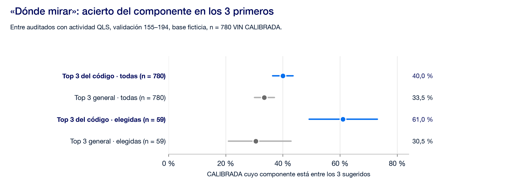
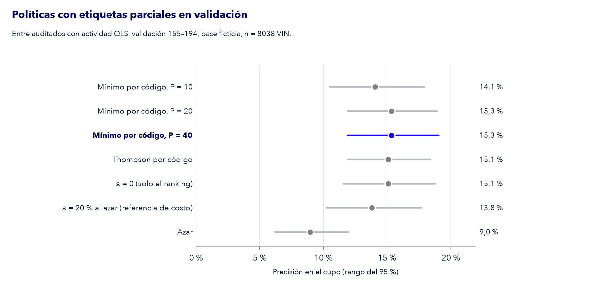
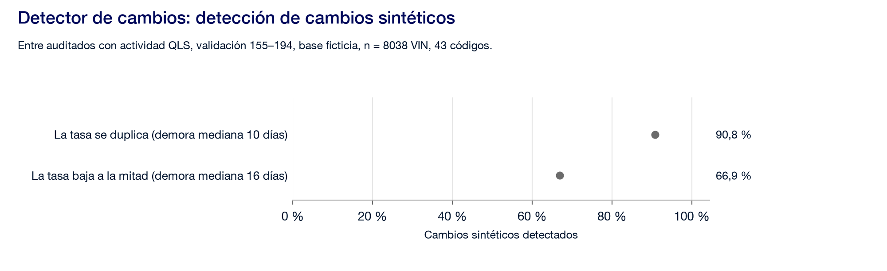

# 4. Valor diferencial e innovación

Borrador para la sección 4 del Informe (E2) y el separador 04 de la presentación. La ficha evalúa la innovación como «creatividad en el análisis de variables y en el enfoque de la solución» ([ficha técnica][ficha], «Criterios de Evaluación»).

**Idea central.** Con el código de catálogo como único predictor admisible, todo modelo estima la misma tabla de tasas por código. La innovación no está en el algoritmo, sino en **cómo se usa esa tasa**: dónde mirar dentro de la unidad elegida, cómo seguir aprendiendo solo con lo que se audita, cómo avisar cuando un código cambia y cómo explicar la prioridad ([alternativas][alt], idea que ordena el ticket).

Cada pieza se configura y se evalúa en validación. Llega a la prueba final solo lo que figura en el preregistro; lo demás se muestra con cifras de validación, rotulado así ([plan][plan-inc], incompatibilidad 3).

| Pieza | Qué aporta | Estado |
| --- | --- | --- |
| [«Dónde mirar»](#1-dónde-mirar-el-componente) | Además de qué unidad auditar, qué componente revisar primero | Mejora en validación |
| [Selección que aprende de sus auditorías](#2-una-selección-que-aprende-de-sus-propias-auditorías) | Sigue aprendiendo en planta sin reservar cupo al azar | P = 40 elegido en validación |
| [Detector de cambios](#3-detector-de-cambios-por-código) | Avisa cuando la tasa de un código cambia | Calibrado y con potencia medida en validación |
| [Señal por mercado de destino](#4-la-señal-está-en-el-mercado-de-destino) | Explica la prioridad en términos que Calidad reconoce | Evaluado en validación |
| [Insumo para la subcategorización](#5-insumo-para-la-subcategorización-del-catálogo) | Aporta datos al trabajo que Ford ya hace sobre el catálogo | No se sostiene en validación |

---

## 1. «Dónde mirar»: el componente

**Qué es.** Para cada código, la distribución del componente que se calibró en sus auditorías anteriores (con Día ≤ t−5), suavizada hacia la distribución general. La hoja podría sugerir los tres componentes a revisar primero en las unidades de ese código ([alternativas][alt], punto 11).

**Por qué.** Los mentores señalaron que «la clave está en detectar qué componente presentó la falla y a qué área está asociado» ([EDA][eda], sección 6, en la versión del equipo). En los experimentos exploratorios, el componente calibrado dependía fuertemente del código ([EDA][eda], sección 7).

**Reglas.** El componente es lo que se predice, **nunca** un predictor de si la unidad se calibra ([admisibilidad][adm], punto 5). Entra en la hoja solo si se sostiene en la prueba final ([mejora útil][mej], punto 13).

**Referencia.** Los 3 componentes más frecuentes en general (≤149) aciertan 261 de 780 CALIBRADA (33,5 %), entre auditados con actividad QLS, validación 155–194, base ficticia, n = 780 VIN CALIBRADA ([plan][plan-rev]).

**Resultado en validación** ([`p6.json`][p6]; rango del 95 % por bootstrap de días, 2.000 remuestreos):

| Sobre qué CALIBRADA | 3 primeros del código | 3 primeros generales | Lectura |
| --- | ---: | ---: | --- |
| Todas las de validación (n = 780) | 312 de 780: 40,0 % (36,4–43,5) | 261 de 780: 33,5 % (30,1–37,0) | mejora |
| Las que eligió la tasa fija (n = 59) | 36 de 59: 61,0 % (49,2–73,1) | 18 de 59: 30,5 % (20,9–42,9) | mejora |

Entre auditados con actividad QLS, validación 155–194, base ficticia. En las unidades que la hoja elige, mirar primero los 3 componentes de su código acierta en unas 6 de cada 10 CALIBRADA, contra 3 de cada 10 con la lista general. En la prueba final (corrida única, entre auditados con actividad QLS, prueba final 200–284, base ficticia): sobre todas las CALIBRADA (n = 1.098 VIN), los 3 primeros del código aciertan 515 (46,9 %; 43,9–50,1) contra 437 (39,8 %; 36,8–42,7) de la lista general, y sobre las 71 que eligió la tasa fija, 45 (63,4 %; 53,2–73,1) contra 25 (35,2 %; 25,8–45,6): mejora en ambas ([`prueba-final.json`](../../solucion/resultados/prueba-final.json)).

*Figura: acierto en los 3 primeros, por código frente a la referencia general, sobre todas las CALIBRADA de validación y sobre las que eligió la tasa fija, entre auditados con actividad QLS, validación 155–194, base ficticia, n = 780 VIN CALIBRADA. Fuente: [`p6.json`][p6].*

---

## 2. Una selección que aprende de sus propias auditorías

**El problema.** Si la hoja orienta todo el cupo, en planta solo se conoce el resultado de lo que la hoja eligió. Los códigos que nunca se eligen dejan de tener datos nuevos, y un código que empeora podría pasar sin verse ([base QLS][qls], punto 7).

**Observaciones.** Un día tiene unos 265 VIN y un cupo de unos 13, contra unos 26 códigos distintos. Con una tasa móvil ilustrativa, el primer código llena todo el cupo en 7 de los 35 días de validación; en mediana, 3 códigos llenan el cupo, entre auditados con actividad QLS, validación 155–194, base ficticia, n = 8.038 VIN ([plan][plan-rev]). Sin corrección, la mayoría de los códigos no recibiría auditorías.

**Decisiones acordadas.** No se reserva una porción permanente del cupo al azar ([base QLS][qls], punto 5). En su lugar:

- **Mínimo por código:** cada código que se produce recibe, por rotación, al menos una auditoría cada P días, aunque no esté priorizado. P se elige en validación entre 10, 20 y 40; si hay empate, el más largo ([plan][plan-par]). En la hoja, esas unidades aparecen en filas de exploración aparte.
- **Asignación por incertidumbre (muestreo de Thompson):** compite con la rotación; dirige la exploración a los códigos con el rango más ancho sin cambiar el formato de la hoja ([base QLS][qls], punto 6).
- **Días de control:** solo durante la implementación inicial, se alternan días con hoja y días al azar para medir la hoja frente al método actual en las mismas condiciones ([base QLS][qls], punto 5).

**Cómo se evalúa sobre la base.** Simulación con etiquetas parciales: completas hasta el Día 149 y, desde el 155, solo las de lo elegido. Se comparan ε = 0, ε = 0 con mínimo por código, Thompson, ε = 20 % como referencia de lo que costaría, y azar ([plan][plan-par]). La simulación usa la opción elegida, la tasa fija (≤149).

Entre auditados con actividad QLS, validación 155–194, base ficticia, n = 8.038 VIN, 391 elegidos en 35 días ([`p5.json`][p5]):

| Política | Elegible | CALIBRADA / elegidos | Precisión en el cupo (rango 95 %) | Veces el azar | Empata con la mejor |
| --- | --- | ---: | ---: | ---: | --- |
| Mínimo por código, P = 10 | sí | 55 / 391 | 14,1 % (10,5–17,9) | 1,42 | no |
| Mínimo por código, P = 20 | sí | 60 / 391 | 15,3 % (11,9–18,9) | 1,55 | la mejor |
| **Mínimo por código, P = 40** | sí | 60 / 391 | 15,3 % (11,9–19,1) | 1,55 | sí: **elegida** |
| Thompson por código | sí | 59 / 391 | 15,1 % (11,9–18,4) | 1,53 | sí |
| ε = 0 (solo el ranking) | referencia | 59 / 391 | 15,1 % (11,6–18,8) | 1,53 | — |
| ε = 20 % al azar | referencia de costo | 54 / 391 | 13,8 % (10,2–17,7) | 1,40 | — |
| Azar | referencia | 35 / 391 | 9,0 % (6,2–12,0) | 0,91 | — |

**Observaciones.** Con etiquetas parciales, el mínimo por código con P = 40 conserva la precisión del ranking puro (15,3 % contra 15,1 %). La regla elige P = 40 porque empata con P = 20 y, entre empatadas, gana el período más largo ([`p5.json`][p5]; [plan][plan-par]). Reservar el 20 % al azar baja la precisión a 13,8 %.

**Días de control, simulados en validación.** Días pares con hoja (18) y días impares al azar (17). Los días al azar estiman que la hoja rinde 1,35 veces el azar (rango 0,75–2,47); con las etiquetas completas, que en planta no se tendrían, la cifra es 1,34 (0,89–1,85). El rango de la estimación es más ancho porque usa la mitad de los días ([`p5.json`][p5]). Entre auditados con actividad QLS, validación 155–194, base ficticia, n = 8.038 VIN.

**Hipótesis.** Los días de control permiten medir en planta la mejora frente al azar sin usar etiquetas de lo no elegido; con pocos días, su rango es ancho, y por eso su duración se calcula con datos reales (sección 5).

*Figura: precisión en el cupo de cada política con etiquetas parciales (solo se conoce lo auditado desde el Día 155), entre auditados con actividad QLS, validación 155–194, base ficticia, n = 8.038 VIN. Fuente: [`p5.json`][p5].*

---

## 3. Detector de cambios por código

**Qué es.** Un CUSUM de Bernoulli por código, que acumula la diferencia entre los resultados observados y la tasa esperada, y avisa cuando esa acumulación supera un umbral ([alternativas][alt], punto 13).

**Por qué.** Ford comentó que identificar cambios como el de DIA_260 es útil para estudiar los patrones de las unidades que no fallaron y extender lo que funciona ([reunión del 22/09][reu]).

**Configuración.** El umbral se calibra con ≤149 para no superar una falsa alarma cada 30 días en todo el catálogo. La potencia y la demora se miden inyectando cambios sintéticos en validación: la tasa de un código se duplica o baja a la mitad ([plan][plan-par]).

**Reglas.** Las detecciones reales son **observaciones, no causas**. El detector no modifica al predictor ([alternativas][alt], punto 13). El mínimo por código le da datos también a los códigos poco elegidos ([base QLS][qls], punto 5).

**Resultado** ([`p6.json`][p6]):

- **Umbral:** h = 4,4, calibrado con ≤149 sobre 94 códigos y 100 permutaciones de días: 0,97 falsas alarmas cada 30 días en todo el catálogo.
- **Potencia**, con cambios sintéticos inyectados el Día 165 en los 18 códigos con al menos 100 VIN en validación (7.192 VIN, 200 réplicas):

| Cambio sintético | Detectados | Demora mediana (p25–p75) |
| --- | ---: | ---: |
| La tasa se duplica | 3.270 de 3.600: 90,8 % | 10 días (5–15) |
| La tasa baja a la mitad | 2.408 de 3.600: 66,9 % | 16 días (12–21) |
| Sin cambio | 0,96 falsas alarmas cada 30 días | — |

- **Con las etiquetas reales de validación:** 7 alarmas en 7 de los 43 códigos durante 40 días (1 de suba, 6 de baja). Son **observaciones, no causas**: el detector no dice por qué cambió un código. Una alarma del Día d se conoce en d + 5, por el margen de resultados.

Entre auditados con actividad QLS, validación 155–194, base ficticia, n = 8.038 VIN.

**Hipótesis.** Detecta mejor las subas que las bajas, porque con tasas bajas una baja deja menos calibraciones para acumular evidencia. Las 7 alarmas reales superan lo esperable por falsas alarmas (unas 1,3 en 40 días), lo que es compatible con la deriva de la tasa en la base, sin probarla.

*Figura: detección del CUSUM ante cambios sintéticos inyectados en validación en 18 códigos, entre auditados con actividad QLS, validación 155–194, base ficticia, n = 8.038 VIN. Fuente: [`p6.json`][p6].*

---

## 4. La señal está en el mercado de destino

**Observaciones.** La agrupación del catálogo que llegó el 29/09 muestra que la posición 3 del código fija el mercado de destino ([agrupación del catálogo][cat], observación 3). Entre auditados con actividad QLS, población principal, base ficticia, n = 54.771 VIN, el χ² contra CALIBRADA es 674,2 para el código completo (98 grupos) y 187,8 para el mercado (9 grupos); motor, versión, familia y tracción quedan entre 21,1 y 28,5 ([agrupación del catálogo][cat], observación 4). En validación, motor, familia y tracción dejan de discriminar (χ² entre 0,0 y 2,6) y el mercado se sostiene (χ² 56,1, n = 8.038 VIN) ([agrupación del catálogo][cat], observación 5).

**Uso.** La variante que suaviza los códigos chicos hacia la tasa de su mercado compitió en validación y tuvo la mayor precisión en el cupo: 17,6 % (13,1–21,9), 1,79 veces el azar, entre auditados con actividad QLS, validación 155–194, base ficticia, n = 8.038 VIN; empata con otras 28 alternativas y por eso la regla elige la tasa fija, más simple ([`p3.json`][p3]; [`eleccion.json`][elec]). La hoja explica cada prioridad por el mercado de destino, en el bloque «por qué este código» ([uso de la agrupación][agr], puntos 1 a 3).

**Hipótesis y límites.** Esto es sobre la base ficticia: no prueba que el mercado cause calibraciones ([agrupación del catálogo][cat], hipótesis). La posición 4 del código sigue sin explicar.

---

## 5. Insumo para la subcategorización del catálogo

**Qué es.** Los códigos se agrupan por el perfil de fallas de sus vehículos, usando solo ≤149, y se comprueba si el orden de tasas entre grupos se mantiene en validación y prueba. Una tabla descriptiva compara esos grupos con la agrupación oficial ([alternativas][alt], punto 14; [uso de la agrupación][agr], punto 4).

**Por qué.** Ford trabaja en una subcategorización de los códigos ([reunión del 22/09][reu]). Los experimentos exploratorios sugirieron que los códigos que «fallan parecido» también se calibran parecido ([EDA][eda], sección 10).

**Reglas.** Es una asociación descriptiva, rotulada «usa el historial, no predice». **Nunca** se usa como predictor ni para suavizar ([alternativas][alt], punto 14).

**Resultado** ([`p6.json`][p6]): con 64 códigos que tienen al menos 30 VIN en ≤149, el agrupamiento por perfil de incidencias elige 3 grupos (silhouette 0,17). **El orden de tasas entre grupos no se mantiene en validación** (τ de Kendall 0,33). Los grupos tampoco coinciden con la agrupación oficial: índice de Rand ajustado 0,06 con el mercado, 0,14 con el motor y −0,01 con la tracción. Entre auditados con actividad QLS, ≤149 y validación 155–194, base ficticia.

**Lectura.** Con esta base, el perfil de fallas no aporta un criterio estable para subcategorizar. Queda la herramienta, lista para repetirse cuando Ford publique su subcategorización (sección 5).

---

## También es diferencial: cómo se evaluó

- **Sin fuga, con la fuga a la vista.** La versión con fuga «gana» en validación (22,3 %) y se muestra justamente para explicar por qué no se usa ([`p3.json`][p3]).
- **Prueba de un solo uso con preregistro.** La opción y sus parámetros se fijan antes de ver la prueba, y lo que no está en el preregistro no se lee ([validación][val], punto 2).
- **Cada cifra con su alcance:** «entre auditados con actividad QLS, [tramo], base ficticia, n = …» ([base QLS][qls], punto 2).

[ficha]: ../fuentes/documentation.md
[eda]: ../../research/eda-qls.md
[cat]: ../../research/catalogo-agrupacion.md
[p3]: ../../solucion/resultados/p3.json
[elec]: ../../solucion/resultados/eleccion.json
[p5]: ../../solucion/resultados/p5.json
[p6]: ../../solucion/resultados/p6.json
[plan-rev]: ../plan-de-accion.md#revisión-de-fuentes-del-2909
[plan-inc]: ../plan-de-accion.md#incompatibilidades-y-cómo-se-resuelven
[plan-par]: ../plan-de-accion.md#parámetros
[adm]: https://github.com/FordwardAI/ford-predictive-quality/issues/6#issuecomment-5804466671
[val]: https://github.com/FordwardAI/ford-predictive-quality/issues/7#issuecomment-5805038014
[mej]: https://github.com/FordwardAI/ford-predictive-quality/issues/8#issuecomment-5801943323
[alt]: https://github.com/FordwardAI/ford-predictive-quality/issues/10#issuecomment-5820794998
[agr]: https://github.com/FordwardAI/ford-predictive-quality/issues/27#issuecomment-5896362581
[qls]: https://github.com/FordwardAI/ford-predictive-quality/issues/29#issuecomment-5896631478
[reu]: https://github.com/FordwardAI/ford-predictive-quality/issues/5#issuecomment-5800841330
