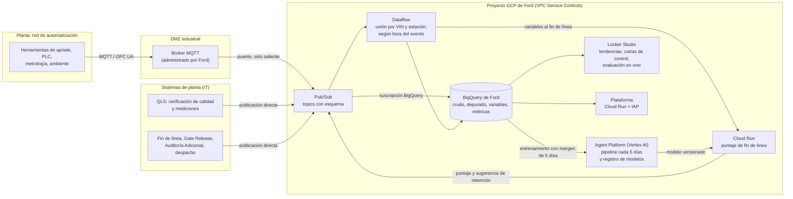

# 5.1 Puntaje de fin de línea y arquitectura en GCP

Borrador para un apartado nuevo de la sección 5 del Informe (E2). Responde al feedback del jurado recibido antes de la entrega extendida del 02/10/2026 ([#33][i33]). Es una **propuesta de evolución**. No cambia la solución evaluada, el preregistro ni las cifras de la prueba final. La plataforma sigue siendo un MVP local; acá se describe cómo se llevaría al entorno de Ford. Al final hay texto listo para las secciones 2.3, 3 y 5 del Informe.

Vocabulario de [CONTEXT.md][ctx]. «Puntaje» traduce el «scoring» que propuso el jurado. **No es la probabilidad de un vehículo**: es un orden de prioridad dentro del cupo.

## Qué planteó el jurado (observaciones)

Según lo relatado por el equipo, sin acta:

1. Un **scoring al final de la línea de producción**: que, con los parámetros de la línea y más allá de la prueba de calidad, se pueda ver la **tendencia de los códigos de catálogo junto con esos parámetros**.
2. **Integrar mediciones en la prueba de calidad.** No quedó claro si se refería a la verificación de calidad (QLS) o a la Auditoría Adicional; abajo se plantean las dos.
3. La información de planta **se puede obtener en tiempo real**. Se mencionaron **MQTT y Pub/Sub** como alternativa posible, no como algo que Ford use hoy.
4. Ford **ya usa BigQuery** para sus datos.
5. El sistema se podría **evaluar en vivo**, e incluso **retener un VIN antes de Gate Release** si aparecen patrones atípicos.

## Propuesta: un solo puntaje que crece con los datos

El puntaje de fin de línea es la **evolución de la hoja de códigos prioritarios**, no un producto aparte. Se calcula con un único servicio y un único contrato, y se le van sumando fuentes a medida que se conectan:

| Etapa | Qué usa el puntaje | Qué devuelve | Estado |
| --- | --- | --- | --- |
| Hoy | Código de catálogo y sus atributos (versión, mercado, motor, tracción) | El mismo valor para todas las unidades de un código, es decir, la hoja actual | Evaluado en la base ficticia (sección 2) |
| Con parámetros de línea | Lo anterior más los parámetros del VIN registrados antes de Gate Release: torque y ángulo, metrología, lote de piezas, paso por estaciones | Un orden por VIN dentro del cupo | Hipótesis a medir |
| Con mediciones en la verificación de calidad | Lo anterior más los valores medidos en la verificación de calidad | Un orden por VIN más fino | Hipótesis a medir |

- **Momento:** el puntaje se calcula cuando el VIN termina la línea, antes de Gate Release, con la información publicada hasta ese instante.
- **Usos:**
  1. Ordenar la derivación a Auditoría Adicional dentro del cupo diario.
  2. Emitir una **sugerencia de retención** antes de Gate Release para casos atípicos.
  3. Alimentar las tendencias por código y parámetro.
- **Caso base y vuelta atrás:** con solo el catálogo, el puntaje coincide con la hoja vigente. Si falta una fuente o falla el servicio, se usa la hoja, y si falla la hoja, la selección al azar vigente.
- **Quién decide:** el responsable de la selección decide qué se deriva, y Calidad de Ford decide si se retiene un VIN. El sistema **no escribe en QLS, en el MES ni en los controladores**: publica una sugerencia con sus motivos.

### Tendencias por código y parámetro

El tablero muestra, para cada código de catálogo, la proporción CALIBRADA entre auditados en el tiempo junto con la distribución de cada parámetro de línea (media y dispersión respecto del nominal y la tolerancia), con cartas de control. El detector de cambios de tasa (sección 4) se extiende a los parámetros, y así se ve si un código empeora al mismo tiempo que se corre un torque o una cota.

Este uso **aporta aunque el puntaje no mejore la selección**: le muestra a Ingeniería dónde se mueve el proceso. Como la selección priorizada cambia qué se audita, las tasas por código siguen describiendo solo lo auditado. Los días de control dan la referencia comparable.

### Mediciones en la prueba de calidad: dónde se toman cambia para qué sirven

| Dónde se registra la medición | Ejemplos | Para qué sirve | Por qué |
| --- | --- | --- | --- |
| **Verificación de calidad (QLS)**, antes de Gate Release | Valores numéricos con nominal y tolerancia: holgura y enrase, torque verificado, alineación si se mide | **Variable del puntaje** | Se conoce antes de elegir |
| **Auditoría Adicional** | Qué se midió y cuánto se ajustó al calibrar | **Solo etiqueta**: define qué ajuste físico representa CALIBRADA y permite una etiqueta graduada en lugar de OK/CALIBRADA | Usarla para elegir sería fuga: el resultado y el componente de la Auditoría Adicional nunca entran como variables |

Recomendamos las dos, cada una en su rol. La segunda es la condición P0 de [datos de proceso][dp]: sin saber qué ajuste físico representa CALIBRADA, no se puede elegir qué parámetro de línea pedir primero.

## Arquitectura en GCP

### Componentes

| Necesidad | Servicio | Por qué este y no otro |
| --- | --- | --- |
| Telemetría de herramientas, PLC y metrología | Broker MQTT en la DMZ, con puente a Pub/Sub. Donde no haya MQTT, OPC UA hacia el mismo borde. Una opción de Google es Manufacturing Connect con Manufacturing Data Engine | MQTT encaja cuando la fuente es un equipo de planta. Google retiró Cloud IoT Core en 2023, así que el broker lo opera Ford. La conexión es solo saliente desde planta |
| Eventos de aplicaciones: QLS, fin de línea, Gate Release, Auditoría Adicional, despacho | Publicación directa en Pub/Sub, con esquema validado y tema de mensajes rechazados | Son sistemas de TI: sumar un broker agregaría piezas sin beneficio |
| Respaldo y primer paso | Exportación por lotes a Cloud Storage y de ahí a BigQuery | Permite empezar sin tocar sistemas de planta. Alcanza para la hoja, no para la retención antes de Gate Release |
| Almacenamiento | El BigQuery que Ford ya usa, en capas: crudo (inmutable), depurado (sin duplicados por `event_id`), variables y métricas. Particionado por fecha y agrupado por código | Una sola fuente auditable. Las tablas de variables se consultan según la hora de cada evento: eso evita la fuga al entrenar |
| Unión de parámetros con el VIN | Dataflow en streaming, con estado por VIN y estación, hora del evento y manejo de datos tardíos | Un VIN tiene varios registros por estación, reintentos y relojes distintos ([datos de proceso][dp]). Al llegar el evento de fin de línea, arma el vector de variables del VIN |
| Puntaje | Cloud Run, con el modelo del registro de modelos, disparado por el evento de fin de línea | Alcanza con una latencia de segundos, escala a cero y no necesita un endpoint dedicado. No usamos el almacén de variables en línea de Agent Platform: cobra nodos por hora y, a este volumen, Dataflow ya entrega las variables |
| Entrenamiento y versiones | Agent Platform Pipelines (antes Vertex AI Pipelines), cada 5 días con Cloud Scheduler, con el código de `solucion/` en un contenedor | Mantiene la actualización por calendario fijo, la copia de los datos de cada versión y el margen de 5 días que ya define la solución |
| Tendencias y evaluación en vivo | Consultas programadas en BigQuery, Looker Studio y alertas de Cloud Monitoring | Calcula precisión en el cupo, veces el azar e intervalo bootstrap por días, más latencia y cobertura de cada fuente |
| Plataforma | Cloud Run con IAP y el inicio de sesión corporativo de Ford, y Cloud SQL en lugar de SQLite | Reutiliza el front React y el contrato actual: `/api/ingreso`, `/api/resultados` y `/api/despacho` pasan a ser topics |

### Contrato de eventos

Todos los mensajes llevan `event_id`, `vin_token` (el VIN seudonimizado al ingresar a GCP), `ts_evento` (cuándo ocurrió), `ts_publicacion` (cuándo se publicó), `origen` y `schema_version`. Pub/Sub entrega cada mensaje al menos una vez, así que la capa depurada descarta duplicados por `event_id`.

| Evento | Campos propios | Uso |
| --- | --- | --- |
| `fin_de_linea` | `codigo_catalogo` | Dispara el puntaje |
| `telemetria_proceso` | `estacion`, `operacion`, `variable`, `valor`, `unidad`, `nominal`, `tol_inf`, `tol_sup`, `intento` | Variable, si se publicó antes del puntaje |
| `medicion_calidad` | `punto`, `valor`, `unidad`, `nominal`, `tolerancia`, `instrumento` | Variable, solo si viene de la verificación de calidad |
| `qls_evento` | Componente, incidencia, tipo, PUL, reemplazo, desmontaje | Variable candidata (ver hipótesis). Nunca se usan inspector ni reparador |
| `gate_release`, `despacho` | — | Estado de la playa de despacho y del cupo |
| `resultado_auditoria` | `resultado`, `componente`, medición del ajuste | **Solo etiqueta** |
| `puntaje_fin_de_linea` | `puntaje`, `version_modelo`, `motivos[]`, `modo` (sombra o activo) | Salida: hoja, sugerencia de retención y tablero |

### Seguridad y privacidad

- **OT e IT separados** según IEC 62443. El borde publica solo hacia afuera; ningún servicio de GCP escribe en QLS, el MES ni los controladores.
- **VIN seudonimizado** con Sensitive Data Protection y claves en Cloud KMS. Las columnas sensibles llevan etiquetas de política, y los reportes se muestran por código.
- **Perímetro y accesos:** VPC Service Controls, claves administradas por el cliente (CMEK), permisos mínimos por servicio, registros de auditoría de Cloud y acceso de usuarios con IAP.
- **Región:** GCP no tiene región en Argentina. Las más cercanas son `southamerica-east1` (São Paulo) y `southamerica-west1` (Santiago) ([regiones][gcp-reg]). La región y la transferencia internacional según la Ley 25.326 las decide Ford IT.

## Evaluación en vivo

Las etapas se ordenan por dependencia, sin calendario:

1. **Conectar y medir.** Por fuente: latencia (`ts_publicacion` − `ts_evento`), cobertura, VIN sin unir por estación y faltantes por día, código y estación.
2. **Puntaje en sombra.** Se calcula para cada VIN sin cambiar la selección ni retener nada. Con los resultados de lo auditado, se compara catálogo solo contra catálogo más parámetros: mismo modelo, mismos VIN, días y cupo, en un período nuevo. Las sugerencias de retención se registran como «se habría retenido» junto al resultado posterior.
3. **Días de control.** Se alternan días priorizados por el puntaje y días al azar con el mismo cupo, como en la sección 5.
4. **Retención activa.** Solo si la etapa 2 muestra evidencia con datos reales y Ford lo aprueba.

## Factibilidad

| Aspecto | Nivel | Motivo |
| --- | --- | --- |
| Captura | Alta | Existen sistemas comerciales que registran apriete y ángulo, holgura y enrase, y soldadura ([datos de proceso][dp]). Falta confirmar cuáles están en Pacheco |
| Integración | Media | Cada medición necesita un identificador trazable al VIN, la hora en que se midió, la hora en que se publicó y llegar antes de elegir. Que la información esté disponible en tiempo real reduce este riesgo |
| Valor | Desconocido | En la simulación, una señal moderada subió la precisión del mismo modelo entre 79 y 87 % frente al catálogo solo. Sin señal no mejoró, y con la relación invertida la ganancia desapareció ([sensibilidad][sens]). No estima el efecto real |
| Operación | Cambio grande | Ordenar por VIN exige identificar el vehículo concreto en la playa, vincularlo con sus mediciones y registrar cuál se envió. La hoja hoy considera equivalentes las unidades de un código |

### Costo de la nube (orden de magnitud)

Son precios de lista en dólares de `us-central1` (Iowa), consultados el 02/10/2026, sin impuestos, red ni descuentos. Las regiones de Sudamérica suelen ser más caras, así que hay que recalcular con la región que elija Ford. El volumen sale de la base ficticia: unos 210 VIN por día (59.681 VIN en 284 días) y unos 690 eventos QLS por día (195.808 en 284 días). La telemetría es un supuesto ilustrativo: 300 registros de 1 KB por VIN, unos 2 GiB por mes.

| Servicio | Precio de lista | Estimación mensual |
| --- | --- | --- |
| Pub/Sub ([precios][ps]) | Primeros 10 GiB gratis por mes, luego USD 40/TiB. La suscripción a BigQuery cuesta USD 50/TiB | Menos de USD 1 |
| BigQuery ([precios][bq]) | Almacenamiento activo USD 0,000031507 por GiB-hora (unos USD 0,023 por GiB-mes), primeros 10 GiB gratis. Consultas a USD 6,25/TiB, primer TiB gratis | Menos de USD 1 de almacenamiento el primer año. Las consultas dependen de los tableros; con particiones deberían entrar en el tramo gratuito |
| Dataflow en streaming ([precios][df]) | USD 0,069 por vCPU-hora, USD 0,003557 por GiB-hora y USD 0,089 por unidad de cómputo de Streaming Engine | 1 worker de 1 vCPU y 3,75 GiB durante 730 h ≈ USD 60, más Streaming Engine según uso |
| Cloud Run ([precios][run]) | Gratis los primeros 180.000 vCPU-segundos, 360.000 GiB-segundos y 2 millones de solicitudes por mes | Unos 6.300 puntajes por mes entran en el tramo gratuito |
| Cloud SQL para la plataforma ([precios][sql]) | USD 0,0413 por vCPU-hora y USD 0,007 por GiB-hora; el doble con alta disponibilidad | 1 vCPU y 3,75 GiB ≈ USD 49 (≈ USD 99 con alta disponibilidad) |
| Agent Platform Pipelines ([precios][ap]) | USD 0,03 por ejecución, más el cómputo del entrenamiento | 6 ejecuciones por mes, menos de USD 1 más minutos de CPU |

**Fórmula para Ford:** costo mensual = Dataflow (workers × horas × tarifa) + Cloud SQL + Pub/Sub y BigQuery por volumen real + horas internas de integración y soporte. A este volumen, la infraestructura queda en el orden de USD 100 a 200 por mes. **El costo que domina es la integración**: conectar fuentes, identificar el VIN en cada una y validar cobertura y latencia. Lo calcula Ford con sus tarifas, igual que en la sección 3. Si Ford ya tiene compromisos de uso en GCP, el costo marginal es menor.

## Hipótesis, decisiones y límites

**Hipótesis (por medir, no prometidas):**
- Los parámetros de línea o las mediciones de la verificación de calidad distinguen unidades de un mismo código. La simulación muestra que, *si* existe una señal moderada, la ganancia sería grande, y que sin señal no la hay.
- Las secuencias y la detección de anomalías del historial QLS se descartaron porque en la base ficticia no separaron calibradas (AUC entre 0,494 y 0,52) y porque no estaba probado que el historial estuviera disponible al elegir ([ideas descartadas](ideas-descartadas.md)). La información en tiempo real resuelve la disponibilidad por construcción, ya que cada evento llega con su hora. Por eso el historial vuelve como **variable candidata en sombra**, no como mejora esperada.

**Decisiones de esta propuesta:**
- El puntaje es la evolución de la hoja. La hoja queda como caso base, control y vuelta atrás.
- El puntaje por VIN y la retención arrancan en sombra.
- No hay escritura en sistemas de planta.

**Abiertas para el equipo y Ford:**
- Si un VIN con sugerencia de retención va a Auditoría Adicional, ¿consume cupo? Si queda fuera del cupo, la comparación con los días de control deja de ser al mismo cupo.
- Los umbrales de retención se fijan con datos reales en sombra, no con la base ficticia.
- La región de datos y la periodicidad de revisión del modelo.

**Límites:** no medimos latencias ni cobertura reales. La base es ficticia y solo incluye auditados con actividad QLS. Ninguna cifra de esta sección es un efecto esperado en planta.

## Preguntas operativas para Ford

Son preguntas sobre la operación, no sobre la solución:

1. ¿Qué evento marca hoy el fin de la línea de un VIN y con qué demora se publica?
2. ¿Qué sistemas de apriete, metrología o trazabilidad registran por VIN o por carrocería? ¿Pueden publicar en tiempo real o solo exportar?
3. ¿La verificación de calidad registra hoy valores medidos o solo incidencias?
4. ¿En qué punto antes de Gate Release se puede retener físicamente un vehículo, y quién lo decide?
5. ¿Qué proyecto, región y política de retención tienen en BigQuery para estos datos?

## Texto para el Informe

Texto para incorporar al documento final. Los encabezados indican la sección del Informe.

**§2.3 Seguridad y privacidad, al final:**

> Si Ford adopta la evolución con puntaje de fin de línea (sección 5), el servicio correría en el proyecto de GCP de Ford. Los eventos saldrían de planta solo hacia afuera: desde la DMZ industrial en el caso de equipos de planta, o publicados directamente por las aplicaciones de TI. Ningún componente escribiría en QLS, el MES ni los controladores. El VIN se seudonimizaría al ingresar, con VPC Service Controls, claves administradas por Ford, permisos mínimos y acceso corporativo. La región y la transferencia internacional (Ley 25.326) las define IT, porque GCP no tiene región en Argentina.

Filas nuevas para la tabla de riesgos:

| Riesgo | Control disponible | Requisito para planta |
| --- | --- | --- |
| Retención sugerida sin fundamento | Modo sombra; motivos visibles; decide Calidad | Evidencia en período nuevo antes de activar la retención |
| Telemetría incompleta o tardía | Hora de evento y de publicación por mensaje; VIN sin datos se mantienen en el denominador | Medir cobertura y latencia por fuente antes de intervenir |

**§3 Factibilidad económica, fila nueva y párrafo:**

| Componente | Costo a presupuestar | Mantenimiento |
| --- | --- | --- |
| Nube (opcional, GCP de Ford) | Pub/Sub, BigQuery, Dataflow, Cloud Run y Cloud SQL al volumen de planta | Monitoreo, versiones y costo mensual del servicio |

> Con precios de lista de GCP consultados el 02/10/2026 y el volumen de la base (unos 210 vehículos por día), la infraestructura de la evolución en tiempo real quedaría en el orden de USD 100 a 200 por mes. El mayor costo sería Dataflow para unir parámetros por VIN y la base de la plataforma. El costo principal sigue siendo integrar y validar las fuentes.

**§5 Trabajo futuro, fila nueva al final de la tabla de etapas:**

| Etapa | Trabajo | Condición para avanzar |
| --- | --- | --- |
| Puntaje de fin de línea | Eventos en tiempo real hacia el BigQuery de Ford; puntaje por VIN con catálogo, parámetros de línea y mediciones de la verificación de calidad, primero en sombra; tendencias por código y parámetro | Cobertura y latencia medidas; aporte incremental frente al catálogo solo en período nuevo; aprobación de Ford para retener |

> Siguiendo la sugerencia del jurado, la hoja evoluciona hacia un puntaje de fin de línea. Se calcula al terminar la línea, antes de Gate Release, con el código de catálogo y los parámetros de la línea publicados hasta ese momento. Con solo el catálogo coincide con la hoja actual, que queda como control y vuelta atrás. Los eventos viajarían en tiempo real hacia el BigQuery que Ford ya usa: por Pub/Sub desde las aplicaciones, y por MQTT donde la fuente sea un equipo de planta. Las mediciones de la verificación de calidad podrían sumarse como variables. Las de Auditoría Adicional servirían solo para definir mejor qué ajuste representa CALIBRADA. El puntaje y las sugerencias de retención antes de Gate Release arrancan en sombra, y se comparan contra el resultado de lo auditado antes de intervenir. Detalle de arquitectura y costos: docs/entrega/05-1-scoring-fin-de-linea.md.

[i33]: https://github.com/FordwardAI/ford-predictive-quality/issues/33
[ctx]: ../../CONTEXT.md
[dp]: ../../research/datos-proceso.md
[sens]: ../../research/sensibilidad-proceso.md
[gcp-reg]: https://cloud.google.com/compute/docs/regions-zones
[ps]: https://cloud.google.com/pubsub/pricing
[bq]: https://cloud.google.com/bigquery/pricing
[df]: https://cloud.google.com/dataflow/pricing
[run]: https://cloud.google.com/run/pricing
[sql]: https://cloud.google.com/sql/pricing
[ap]: https://cloud.google.com/vertex-ai/pricing
