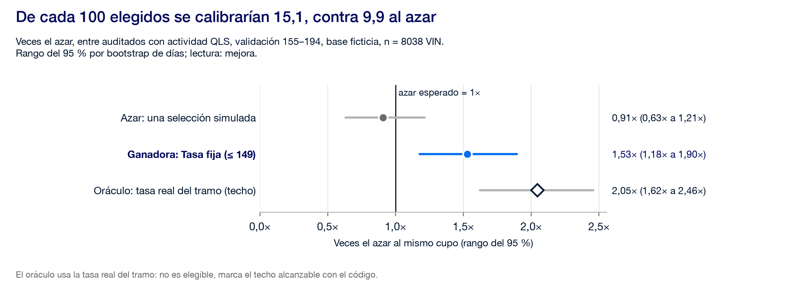

# Figuras de la entrega

Generado por `solucion/figuras.py` (P9, [#33](https://github.com/FordwardAI/ford-predictive-quality/issues/33)); no editar a mano. Se regenera con:

```sh
.venv/bin/python -m solucion.run --csv "<CSV>" --catalogo "<catálogo>" --piezas p9
```

Las figuras de resultados usan solo los agregados de `solucion/resultados/` y cifras de **validación** (Día del VIN 155–194), no de la prueba final. PNG a 200 dpi para el informe y la presentación; SVG para editar.

## comparacion_alternativas


- Archivos: [`comparacion_alternativas.png`](comparacion_alternativas.png), [`comparacion_alternativas.svg`](comparacion_alternativas.svg)
- Fuente: p3.json, p4.json, eleccion.json
- Leyenda: Precisión en el cupo por alternativa, con rango del 95 % (bootstrap por días), entre auditados con actividad QLS, validación 155–194, base ficticia, n = 8038 VIN. La ganadora (tasa fija (≤ 149)) es la más simple entre las que empatan con la mejor (móvil 120 d hacia el mercado, peso 20). El oráculo (techo) y la versión con fuga (didáctica) no son elegibles. La línea vertical es el azar al mismo cupo.

## veces_azar



- Archivos: [`veces_azar.png`](veces_azar.png), [`veces_azar.svg`](veces_azar.svg)
- Fuente: p3.json, eleccion.json
- Leyenda: Veces el azar de la ganadora (tasa fija (≤ 149)): 1,53×, rango del 95 % 1,18× a 1,90×, entre auditados con actividad QLS, validación 155–194, base ficticia, n = 8038 VIN. Se compara con una selección al azar simulada y con el oráculo (techo).

## etiquetas_parciales


- Archivos: [`etiquetas_parciales.png`](etiquetas_parciales.png), [`etiquetas_parciales.svg`](etiquetas_parciales.svg)
- Fuente: p5.json
- Leyenda: Precisión en el cupo de cada política de exploración con etiquetas parciales (solo se conoce lo auditado desde el Día 155), entre auditados con actividad QLS, validación 155–194, base ficticia, n = 8038 VIN.

## donde_mirar


- Archivos: [`donde_mirar.png`](donde_mirar.png), [`donde_mirar.svg`](donde_mirar.svg)
- Fuente: p6.json
- Leyenda: Acierto en los 3 primeros componentes por código («top 3 del código») frente a los 3 más frecuentes en general, sobre todas las CALIBRADA de validación y sobre las CALIBRADA que eligió la ganadora, entre auditados con actividad QLS, validación 155–194, base ficticia, n = 780 VIN CALIBRADA.

## detector_potencia


- Archivos: [`detector_potencia.png`](detector_potencia.png), [`detector_potencia.svg`](detector_potencia.svg)
- Fuente: p6.json
- Leyenda: Detección del CUSUM de Bernoulli por código (umbral calibrado con ≤149 para ≤1 falsa alarma cada 30 días) ante cambios sintéticos inyectados en validación en 18 códigos, entre auditados con actividad QLS, validación 155–194, base ficticia, n = 8038 VIN, 43 códigos.

## diagrama_proceso


- Archivos: [`diagrama_proceso.png`](diagrama_proceso.png), [`diagrama_proceso.svg`](diagrama_proceso.svg)
- Fuente: docs/plan-de-accion.md (revisión de fuentes y operación de selección)
- Leyenda: Proceso Body → Pintura → Montaje → Calidad → Gate Release → Auditoría Adicional. La hoja de códigos prioritarios entra en la playa de despacho, donde el equipo de analistas elige las unidades en rondas de ~2 h leyendo el código en la etiqueta del parabrisas, con el cupo diario que fija Calidad de Planta.

## diagrama_solucion


- Archivos: [`diagrama_solucion.png`](diagrama_solucion.png), [`diagrama_solucion.svg`](diagrama_solucion.svg)
- Fuente: docs/plan-de-accion.md (contrato común, P5, P6 y P8)
- Leyenda: Entradas (programa del día, cupo diario de Calidad de Planta, resultados de auditorías con Día ≤ t−5 desde QLS y catálogo), recálculo diario (tasa por código de la alternativa elegida en validación, mínimo por código y detector de cambios) y salidas (hoja de códigos prioritarios en planilla e imprimible con la lista de unidades sugeridas, y «dónde mirar» si se sostiene).
