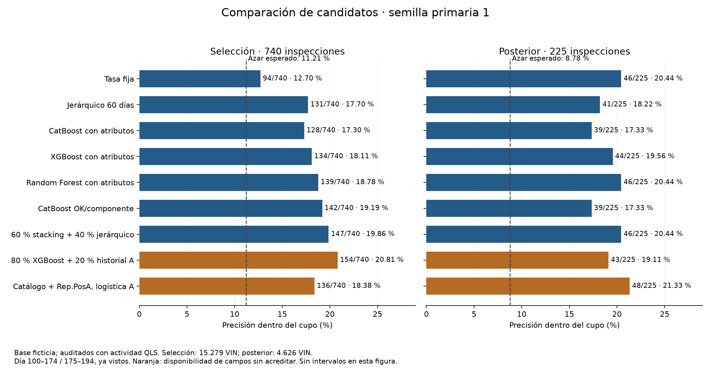
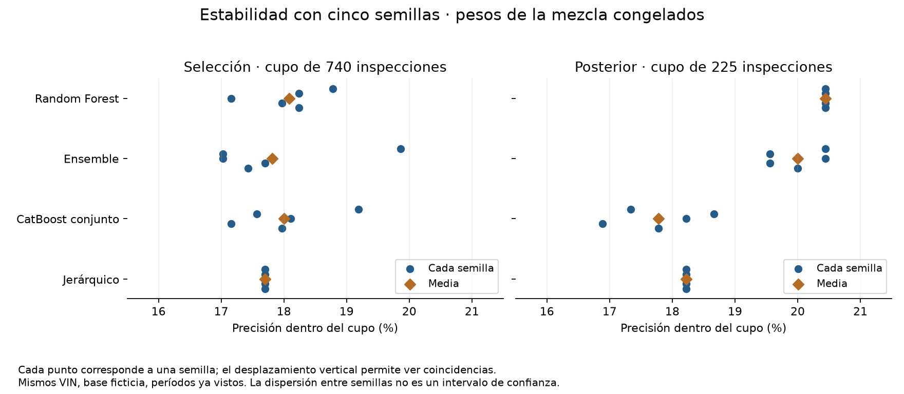

# Estudio comparativo de modelos, columnas y ensembles

Ampliación pedida por Facundo el 30/09/2026, en [#33](https://github.com/FordwardAI/ford-predictive-quality/issues/33), después de la comparación CatBoost + móvil. Incluye combinaciones de más de dos, otras columnas y datos sintéticos. **Todo es exploratorio; no se relee la prueba final ni se cambia la solución operativa.**

## Conclusión para elegir candidatos

**Recomendación provisional del análisis: Random Forest fijo con atributos del catálogo como candidato principal para una próxima evaluación; tasa fija como control; stacking + jerárquico como competidor; Rep.PosA como investigación condicionada a disponibilidad.** Esta recomendación combina rendimiento, estabilidad observada y complejidad. No es la regla preregistrada de adopción, ni una decisión del equipo de reemplazar la solución vigente.

RF promedia **133,8/740 (18,08 %) en selección** y logra **46/225 (20,44 %) en cada una de las cinco semillas** posteriormente. La mezcla promedia **131,8/740 (17,81 %) y 45/225 (20,00 %)**. Su máximo con la semilla primaria, 147/740, no representa un rendimiento estable entre semillas. Tasa fija también logra 46/225 posteriormente: ese tramo por sí solo no acredita superioridad de RF sobre el control.

El mayor máximo de selección, 154/740, exige historial A y cae a 43/225 posteriormente. Rep.PosA logra 136/740 y 48/225 con logística, pero no tiene comprobación de cinco semillas ni disponibilidad previa acreditada. Los sintéticos ayudan a un control específico; no lideran la selección. Las bandas por búsqueda incluyen cero: no se demuestra una ventaja general del ensemble sobre el mejor individual.

Para leer el estudio: [comparación principal](#resultados), [semillas](#estabilidad-con-cinco-semillas-pesos-congelados), [columnas y sintéticos](#columnas-y-aumentación), [recomendación y decisiones](#recomendación-y-decisiones), [catálogo completo](anexo-busqueda.md).

## Pregunta y recorrido del estudio

La pregunta operativa es qué enfoque concentra más VIN CALIBRADA dentro del cupo diario simulado de aproximadamente 5 %, usando información disponible antes de decidir. La unidad es VIN: se construye una representación a partir de sus eventos QLS, conservando una etiqueta final por unidad. Una buena clasificación global o ROC-AUC no garantiza acertar en ese cupo.

| Etapa | Pregunta | Evidencia conservada |
| --- | --- | --- |
| Exploraciones previas | ¿Qué señal ofrecen catálogo e historial? | [Experimentos anteriores](experimentos-modelado.md), [historial por VIN](historial-vin.md) |
| Elección por precisión temporal | ¿Qué alternativas concentran más calibradas con atributos y origen móvil? | [Código](../solucion/precision.py), [agregados](../solucion/resultados/precision.json) |
| Mezcla inicial | ¿CatBoost + tasa móvil mejora a sus componentes? | [Informe](ensemble-catalogo.md), [agregados](../solucion/experimentos/resultados/ensemble.json) |
| Búsqueda amplia | ¿Ayudan otros campos, objetivos, aumentación y más integrantes? | Este informe y [búsqueda](../solucion/experimentos/resultados/busqueda.json) |
| Robustez | ¿Qué queda con catálogo disponible y cinco semillas? | [Catálogo/adaptación](../solucion/experimentos/resultados/robustez_busqueda.json), [semillas](../solucion/experimentos/resultados/semillas_busqueda.json) |

Las etapas anteriores explican la evolución del análisis, pero no se mezclan sus cifras como si pertenecieran a una corrida común. El contraste principal de este informe se recalculó en los mismos bloques. Ninguna etapa convierte períodos ya explorados en datos nuevos.

## Fuente, población y reproducción

- CSV vigente: SHA-256 `a24860d86afdd841d1c9c4ac12155a861299b80dbc161bcd17d2aaff43c5a82b`.
- Catálogo: SHA-256 `89e5a9d9c4312a408f996bea3e170e44428827a458fa62d76936648e1733e047`.
- Unidad VIN, entre auditados con actividad QLS, base ficticia. Se conservan la población y los filtros acordados, sin deduplicación nueva. La auditoría completa reconcilia 195.808 eventos y 59.681 VIN. Resultados de selección/comprobación se dan con sus propios denominadores.
- Código: [`busqueda.py`](../solucion/experimentos/busqueda.py), [`columnas.py`](../solucion/experimentos/columnas.py). Entorno en `requirements.txt` y Python 3.13. Semilla primaria 1; desempate 20261002; bootstrap 20261003, 2.000 remuestreos.

```sh
.venv/bin/python -m solucion.run --csv '<CSV>' --catalogo '<catálogo>' --cache '<carpeta fuera del repo>' --salida '<carpeta fuera del repo>' --piezas busqueda
.venv/bin/python -m solucion.experimentos.robustez_busqueda --predicciones '<cache>/busqueda-<hash>.pickle' --salida solucion/experimentos/resultados/robustez_busqueda.json
.venv/bin/python -m solucion.run --csv '<CSV>' --catalogo '<catálogo>' --cache '<carpeta fuera del repo>' --salida '<carpeta fuera del repo>' --piezas semillas_busqueda
MPLCONFIGDIR='<carpeta temporal>' .venv/bin/python research/documentar_busqueda.py
.venv/bin/python -m solucion.pruebas
python3 research/test_audit_dataset.py
git diff --check
```

La caché externa conserva predicciones y etiquetas anteriores a Día 195; no se publica. El archivo pickle debe ser exclusivamente la caché local propia, nunca un archivo recibido de terceros. La tabla de prueba sigue enmascarada. Se publica únicamente evidencia agregada. La corrida principal identifica el código `23da09a`; la revisión, `7e55ff5`; la comprobación de semillas añade el código publicado en esta PR. No se reentrena la búsqueda principal al agregar su informe.

El generador documental lee solo los tres JSON publicados y regenera [el anexo](anexo-busqueda.md) y las dos figuras siguientes. El código de semillas está en el commit `12d02f6`; sus agregados registraron `7e55ff5+cambios` porque se calcularon antes de ese commit. Se conserva ese registro original. Fuente, filtro poblacional y temporalidad completos: [auditoría de preparación](../solucion/resultados/preparacion.json), [particiones](validation-partitions.json) y [datos locales](../docs/datos-locales.md).

## Métricas e interpretación

| Métrica | Cálculo | Qué permite interpretar |
| --- | --- | --- |
| Aciertos | VIN CALIBRADA dentro del cupo elegido | Comparación directa cuando los cupos coinciden |
| Precisión en el cupo | Aciertos / inspecciones elegidas | Cuántos elegidos requieren calibración |
| Recall o recupero | Aciertos / todos los CALIBRADA del tramo | Qué fracción de casos se recupera con capacidad limitada |
| Azar esperado | Suma por día de cupo × proporción CALIBRADA del día, dividida por cupo total | Control con la misma disponibilidad y capacidad diaria |
| Lift o veces el azar | Precisión / precisión esperada al azar | Concentración relativa de casos |
| Diferencia pareada | Diferencia de precisión con remuestreo de los mismos días | Incertidumbre temporal descriptiva entre alternativas |

ROC-AUC, PR-AUC y calibración probabilística son diagnósticos posibles, pero **esta búsqueda amplia no publica una comparación completa de esas métricas**. Sus máximos se eligen por aciertos/precisión en el cupo; no se afirma haber optimizado PR-AUC ni disponer de probabilidades calibradas. Los informes previos de historial sí conservan sus propios diagnósticos de AUC.

En comprobación, 46 aciertos significan **46/225 = 20,44 % de precisión**, **46/408 = 11,27 % de recupero** y **2,33× el azar esperado**. No significa recuperar el 20,44 % de todos los casos, ni que el 5 % auditado sea la prevalencia CALIBRADA.

## Catálogo del experimento

1. Todas las familias existentes sobre catálogo: logística, Naive Bayes, Random Forest, XGBoost, LightGBM, CatBoost y MLP. Modos fijo y reentrenado, código solo y atributos cuando el modelo los admite. Promedios y stacking existentes; tasas fija, móvil, mercado, jerárquica y decaimiento con sus parámetros acordados.
2. Las siete implementaciones existentes de historial: logística, árboles, riesgo por combinaciones, MIL promedio/atención y LambdaMART, con y sin historial. Escenarios A (todos los eventos hasta el Día del VIN) y B (hasta Día−5). LambdaMART entrega puntuaciones: se convierten a rangos diarios para mezclarlas; no se interpretan como probabilidades.
3. Todas las 37 columnas restantes del CSV, además del catálogo y sus atributos: cada una por separado con logística, grupos de tiempos/inspección/reparación, exclusión de cada grupo, conjunto completo, y subconjuntos top 5/10/20 elegidos por coeficientes de entrenamiento. El conjunto y subconjuntos compiten con logística, CatBoost y LightGBM; RF y XGBoost también prueban conjunto completo y base.
4. Aumento en entrenamiento: pesos por clase, bootstrap de positivos hasta balancear e interpolación de resúmenes numéricos entre positivos del mismo código. Las categorías se copian del donante; los conteos no se interpolan. Cada política se prueba con y sin corrección por el cambio de proporción de clases, usando logística, CatBoost y LightGBM.
5. Objetivo conjunto de OK o componente calibrado, mediante clasificación multiclase con logística, CatBoost y LightGBM. Para priorizar se usa `1 − P(OK)`. El componente es una etiqueta de entrenamiento, nunca un predictor. Esto evalúa una formulación conjunta concreta, no todas las redes multitarea posibles.
6. Todas las parejas de individuales, con pesos 10/90 a 90/10. Un representante por familia, elegido en selección, forma el pool para **todos** sus subconjuntos de dos o más: promedio de probabilidades/puntuaciones, promedio de rangos y mediana. Pesos en pasos de 25 %, hasta cuatro integrantes; búsqueda continua mediante evolución diferencial con dos semillas y presupuestos prefijados.
7. Meta-modelos temporales: stacking logístico con cuatro regularizaciones, RF y LightGBM; pesos convexos por log-loss y Brier. Sus doce entradas se fijan por nombre antes de elegir ganadores, evitando elegir features del meta con resultados futuros.

| Configuraciones de la búsqueda principal | Cantidad |
| --- | ---: |
| Pipelines individuales | 238 |
| Todas las parejas de individuales, nueve pesos | 253.827 |
| Subconjuntos del pool por promedio | 65.519 |
| Subconjuntos del pool por mediana | 65.519 |
| Subconjuntos del pool por promedio de rangos | 65.519 |
| Pesos en pasos de 25 %, tres/cuatro entradas | 3.500 |
| Vectores visitados por búsqueda continua | 3.968 |
| Meta-modelos temporales y pesos convexos | 8 |
| **Total** | **458.098** |

El pool tiene 16 representantes, identificados en [el anexo](anexo-busqueda.md#pool-de-representantes).
Los ocho metas usan doce entradas prefijadas. El total no implica 458.098 entrenamientos diferentes: muchos
pesos y reglas reutilizan las mismas predicciones individuales.

## Temporalidad y columnas

- Selección en 100–118, 119–137, 138–156 y 157–174; comprobación en 175–194. Ambos tramos ya vistos. Un tramo de predicciones fuera de entrenamiento, 70–94, permite arrancar los meta-modelos sin ajustarlos con los resultados que van a evaluar.
- Modelos de catálogo: ajuste interno del protocolo existente; predicción solo con resultados de Día ≤t−5. Modelos de campos: configuración prefijada y entrenamiento hasta inicio del bloque−6; no se ajustan mirando la comprobación. Meta-modelos: únicamente predicciones anteriores al inicio del bloque−6 y sus etiquetas ya disponibles.
- VIN es agrupación, no predictor. Resultado y componente de Auditoría Adicional son objetivos, no predictores. El catálogo entra como base. Estas exclusiones no son un descarte por rendimiento: protegen el experimento de identificar unidades o revelar la respuesta.
- Campos categóricos: frecuencias, nulos, distintos y conteos. Vocabulario aprendido solo en entrenamiento: hasta 50 valores por campo, con al menos 30 VIN de entrenamiento. Valores raros/nuevos no reciben su propio indicador, pero se conservan conteos y nulos. No se eliminan VIN por nulos.
- Fechas: resúmenes relativos al Día del VIN; horas: media, mínimo, máximo y amplitud. El Día del VIN sigue siendo aproximado; no se convierte en fecha acreditada de auditoría. Los escenarios A/B no prueban disponibilidad real al seleccionar.
- Sintéticos: solo se aumenta entrenamiento. Los tramos evaluados contienen exclusivamente VIN originales. Las etiquetas sintéticas se heredan de sus donantes: **no son nueva evidencia de calibración**, ni prueban plausibilidad física. La corrección de proporciones es una hipótesis de cambio de prior, especialmente débil cuando se interpolan campos.

## Interpretación fijada antes de leer resultados

El ganador se elige por aciertos en selección. El tramo posterior no elige pesos, columnas ni integrantes. Se comparan también todos los individuales y los mejores de cada método/tamaño; un máximo aislado no acredita superioridad. Los rangos pareados descriptivos se acompañan de una banda bootstrap simultánea, centrada, sobre el catálogo de mezclas evaluadas; es **condicional al pool seleccionado** y no corrige todas las decisiones previas sobre datos ya explorados.

## Resultados

### Observaciones

Se evaluaron **238 pipelines individuales y 458.098 configuraciones**. Algunas son equivalentes o muy próximas: el número expresa cobertura de configuraciones, no hipótesis independientes. La revisión con entradas de catálogo comprende 74 individuales y 125.377 configuraciones **incluidas o derivadas de esa misma búsqueda**; no se suman como búsquedas disjuntas.

Selección: Día 100–174, 67 días con actividad, 15.279 VIN, 1.702 CALIBRADA y 740 inspecciones elegidas. Comprobación: Día 175–194, 19 días con actividad, 4.626 VIN, 408 CALIBRADA y 225 inspecciones elegidas. El cupo se redondea por día según el evaluador existente; no es exactamente 5 % al agregar días. La precisión es CALIBRADA encontradas / inspecciones elegidas.

| Alternativa, semilla primaria 1 | Selección | Comprobación |
| --- | ---: | ---: |
| Azar esperado con el mismo cupo diario | ≈82,97/740 (11,21 %) | ≈19,77/225 (8,78 %) |
| Tasa fija, control vigente | 94/740 (12,70 %) | 46/225 (20,44 %) |
| 20 % logística de historial A + 80 % XGBoost con atributos reentrenado | 154/740 (20,81 %) | 43/225 (19,11 %) |
| 40 % tasa jerárquica 60 días, peso 20 + 60 % stacking fijo | 147/740 (19,86 %) | 46/225 (20,44 %) |
| CatBoost conjunto OK/componente, entradas de catálogo | 142/740 (19,19 %) | 39/225 (17,33 %) |
| Random Forest con atributos, fijo | 139/740 (18,78 %) | 46/225 (20,44 %) |
| Tasa jerárquica 60 días, peso 20 | 131/740 (17,70 %) | 41/225 (18,22 %) |
| XGBoost con atributos reentrenado | 134/740 (18,11 %) | 44/225 (19,56 %) |
| CatBoost con atributos reentrenado | 128/740 (17,30 %) | 39/225 (17,33 %) |
| Catálogo + Rep.PosA, logística A | 136/740 (18,38 %) | 48/225 (21,33 %) |



Figura descriptiva de la semilla primaria: mismos tramos y cupos, sin intervalos dibujados. Los valores esperados del azar pueden ser fraccionarios; no representan un sorteo realizado. Las barras naranjas requieren campos de disponibilidad todavía sin acreditar.

La tasa fija representa el mismo tipo de estimador que el control vigente, ajustado con el pasado permitido antes
de cada bloque (`ml.fin_interno`). No se aplica retrospectivamente una tasa entrenada hasta Día 194 a días anteriores.

La combinación de historial A + XGBoost es el máximo exploratorio y exige historial A, cuya disponibilidad al decidir no está acreditada. Stacking + jerárquico es el máximo de la búsqueda restringida a catálogo: su stacking ya reúne siete modelos, por lo que **se evaluaron combinaciones de muchos más de dos**. En la primera semilla encuentra 2,33 veces los casos esperados con azar en el mismo cupo posterior; recupera 46/408 = 11,27 % de los CALIBRADA de ese tramo. Eso no estima impacto en la población completa de planta.

Con esa semilla, RF supera a CatBoost con atributos por **11 aciertos en selección y 7 posteriormente**, y a tasa fija por **45 en selección y 0 posteriormente**. Ensemble supera a RF por **8 en selección y 0 posteriormente**. CatBoost conjunto supera a RF por **3 en selección, pero obtiene 7 menos posteriormente**. Son diferencias observadas; no pruebas de superioridad estadística.

El máximo seleccionado pierde su ventaja al considerar la búsqueda: la banda simultánea descriptiva para ganador general menos mejor individual es −5,29 a +8,53 puntos de precisión; para el máximo de catálogo, −5,49 a +6,84 puntos. Ambas incluyen cero. Son bandas condicionales al pool y al comparador elegidos; no constituyen inferencia selectiva completa ni validación independiente.

### Estabilidad con cinco semillas, pesos congelados

La pareja de catálogo se volvió a entrenar con semillas 1–5 sin elegir nuevos integrantes o pesos. La primera semilla reproduce exactamente 147/46 para la mezcla, 142/39 para CatBoost conjunto y 139/46 para RF. Los resultados son:

| Alternativa | Aciertos de selección por semilla, sobre 740 | Aciertos posteriores por semilla, sobre 225 |
| --- | --- | --- |
| Mezcla 60 % stacking + 40 % jerárquico | 147, 126, 126, 131, 129 | 46, 44, 46, 44, 45 |
| Stacking solo | 100, 95, 100, 103, 92 | 44, 42, 44, 42, 44 |
| Jerárquico solo | 131, 131, 131, 131, 131 | 41, 41, 41, 41, 41 |
| CatBoost conjunto | 142, 130, 134, 127, 133 | 39, 42, 41, 38, 40 |
| RF con atributos fijo | 139, 135, 127, 133, 135 | 46, 46, 46, 46, 46 |

La mezcla promedia 131,8 aciertos en selección y 45 posteriormente; RF 133,8 y 46; CatBoost conjunto 133,2 y 40. **No se confirma una ventaja estable de la mezcla sobre RF.** RF es una referencia fuerte para una siguiente evaluación, sin seleccionar retrospectivamente la semilla que más rinde. Las cinco semillas usan los mismos VIN: no son cinco muestras independientes. El jerárquico no tiene entrenamiento aleatorio, de ahí sus resultados idénticos.



Cada punto representa una semilla y el rombo la media. La dispersión mide sensibilidad al entrenamiento aleatorio, no incertidumbre de muestreo. Que RF tenga 46 aciertos en todas las semillas no prueba que sus predicciones o los VIN seleccionados sean idénticos.

### Columnas y aumentación

Cada una de las 37 columnas adicionales tuvo una prueba individual con logística en A/B, además de grupos, ablaciones, conjunto completo y selección de campos en entrenamiento. Eso evalúa una representación concreta; no demuestra que una columna carezca de información bajo cualquier transformación.

| Pipeline con mismas entradas de catálogo como control | Base catálogo | Todos los campos A | Todos los campos B |
| --- | --- | --- | --- |
| Logística | 112/740; 46/225 | 102/740; 39/225 | 105/740; 45/225 |
| CatBoost | 125/740; 42/225 | 112/740; 43/225 | 112/740; 39/225 |
| LightGBM | 136/740; 43/225 | 112/740; 40/225 | 118/740; 40/225 |
| XGBoost | 131/740; 44/225 | 113/740; 44/225 | 118/740; 42/225 |
| RF | 133/740; 44/225 | 106/740; 38/225 | 128/740; 41/225 |

El mejor campo individual en selección fue **Rep.PosA con logística A: 136/740 y 48/225**, frente a 112/740 y 46/225 del control de catálogo del mismo pipeline. Es una señal para investigar, con multiplicidad y disponibilidad todavía sin resolver; no se descarta. Agregar todos los campos perjudicó estos modelos en selección; no implica que ninguna combinación específica pueda ayudar.

La interpolación sintética B con LightGBM pasó de 118/740 a **128/740**, y de 40/225 a **44/225**. Mejora ese control de campos, pero queda por debajo de LightGBM catálogo en selección (136/740). El mejor sintético A alcanzó 105/740 y 39/225. Pesos de clase y sobremuestreo tampoco superaron el máximo de catálogo en selección. Se conservan sus resultados: no se convierte este experimento en un descarte universal de datos sintéticos. Ninguna política creó etiquetas verificadas nuevas; no sirve para suplir ausencia de positivos o controles de planta.

### Historial, ranking y mezclas mayores

MIL promedio A obtuvo 108/740 y 45/225; atención A, 109/740 y 45/225. LambdaMART sin historial: 132/740 y 41/225; con A: 100/740 y 42/225; con B: 114/740 y 41/225. Estas implementaciones no lideran la selección; no agotan las arquitecturas de secuencias o atención.

El mejor conjunto de tres por mediana alcanzó 145/740 y 46/225; el promedio de tres, 144/740 y 43/225. Una mezcla continua del pool de 16 alcanzó 150/740 y 44/225. Promediar los 16 dio 128/740 y 43/225. Agregar integrantes no garantizó mejora. Stacking temporal, metas RF/LightGBM y pesos convexos tampoco superaron el máximo seleccionado. Ver los ganadores por método/tamaño y todos los individuales en los JSON.

### Selección adaptativa como diagnóstico

Se añadió una regla que elige únicamente entre individuales, parejas prefijadas y metas usando aciertos de bloques anteriores disponibles hasta inicio−6. Se excluyen los subconjuntos cuyo pool se eligió con toda la selección. En 119–194 (68 días, 16.162 VIN, 785 inspecciones), obtuvo **135/785 = 17,20 %**, frente a **112/785 = 14,27 %** de elegir solo individuales. La diferencia pareada descriptiva fue +0,52 a +5,32 puntos.

La regla respeta el tiempo dentro de cada cálculo y sus pruebas lo comprueban. Sin embargo, **se añadió después de ver resultados sobre estos períodos**: es diagnóstico retrospectivo, no protocolo prospectivo ni confirmación independiente. El período anterior al primer bloque evaluado actúa como arranque, no se suma a los denominadores del diagnóstico.

### Recomendación y decisiones

| Opción | Lugar propuesto en la próxima evaluación | Motivo y condición |
| --- | --- | --- |
| RF fijo con atributos del catálogo | Candidato principal | Buen promedio de selección y 46/225 en cinco semillas; menos integrantes que el stacking + jerárquico. Confirmar con períodos nuevos. |
| Tasa fija | Control imprescindible | Solución vigente, sencilla; también 46/225 posteriormente. No retirarla por una comparación retrospectiva. |
| Stacking + jerárquico, pesos 60/40 | Competidor | Mejor máximo de catálogo en la semilla primaria; promedio menor que RF, ventaja no estable. |
| Rep.PosA con logística | Investigación condicionada | 48/225 posteriormente; exige evidencia de disponibilidad, más semillas y control de multiplicidad. |
| CatBoost OK/componente | Competidor secundario | Señal en selección; menor rendimiento posterior que RF en las cinco semillas. |
| Sintéticos y modelos de historial | Menor prioridad con esta evidencia | Beneficios específicos sin liderazgo estable; falta validar disponibilidad o plausibilidad. No descartados universalmente. |

Para una comparación prospectiva se deben congelar candidatos, pesos, representación de columnas y regla de elección antes de leer nuevos resultados. Si se desea un RF formado por varias semillas, ese promedio de predicciones sería **otro candidato**: aquí se promedian métricas para estudiar estabilidad, no se entrenó ni evaluó ese ensemble de semillas.

- Hipótesis: combinar suavizado jerárquico con modelos de catálogo puede mejorar algunos períodos; la ventaja de la mezcla ganadora no es estable ante semillas.
- Hipótesis: Rep.PosA contiene señal adicional que merece comprobar disponibilidad y reproducibilidad antes de incorporarse. El componente como objetivo conjunto es útil en selección, pero su ventaja no se mantiene posteriormente frente a RF.
- Decisión de alcance autorizada por Facundo: probar estos candidatos, otras columnas y sintéticos, con agregados reproducibles y solo Día <195. No se acordó cambiar el preregistro, releer prueba final, adoptar un candidato ni desplegar.
- Próximo paso científico: congelar candidatos y evaluarlos sobre períodos realmente nuevos, verificando qué campos están disponibles al seleccionar. Continuar buscando sobre los mismos VIN no produce esa evidencia.

### Verificación y límites de ejecución

La auditoría completa mantiene hashes y reconciliación de eventos/VIN; las pruebas sintéticas cubren desempates, combinaciones, corte temporal, etiquetas excluidas, aumentación solo en entrenamiento y selección adaptativa. La comprobación de semillas añade control del margen de entrenamiento y de denominadores originales. No se agregaron dependencias.

La búsqueda amplia emitió siete avisos de falta de convergencia de logística (`lbfgs`, límite 2.000 iteraciones); terminó sin errores. No se atribuyen aquí a un candidato específico: la sensibilidad numérica de esos ajustes queda sin resolver. Además, el CatBoost básico local no reproduce exactamente una cifra histórica de otra corrida, como registra [el experimento previo](ensemble-catalogo.md). Las comparaciones publicadas usan controles calculados en la misma corrida; no se reemplaza esa discrepancia por una explicación inventada.

Evidencia: [búsqueda principal](../solucion/experimentos/resultados/busqueda.json), [catálogo y selección adaptativa](../solucion/experimentos/resultados/robustez_busqueda.json), [cinco semillas](../solucion/experimentos/resultados/semillas_busqueda.json).

El [anexo](anexo-busqueda.md) permite revisar cada pipeline y los máximos por método/tamaño sin buscar dentro de un JSON. Conserva la lista completa de columnas y representantes; los ajustes por bloque, pesos y rangos quedan en los agregados enlazados. Solo se publican resultados agregados revisados, sin VIN, extractos individuales ni rutas personales.

## Límites de la cobertura

La búsqueda es finita, explícita y reproducible. No agota todas las arquitecturas, derivaciones de campos, hiperparámetros o pesos continuos. Los pares cubren todas las variantes individuales; los conjuntos mayores cubren representantes por familia, no todos los subconjuntos de todas las variantes. Las columnas se prueban individualmente, por grupos, juntas y con selección aprendida; no todos los 2^37 subconjuntos posibles. La interpolación es sobre resúmenes del VIN, no un simulador del proceso ni un generador validado de eventos. No se fabrican nuevas etiquetas de planta.

No se puede demostrar mejora independiente buscando más sobre los mismos períodos. Un candidato prometedor requerirá períodos nuevos o evaluación en planta; la prueba final ya vista no se reutiliza para esta búsqueda.
